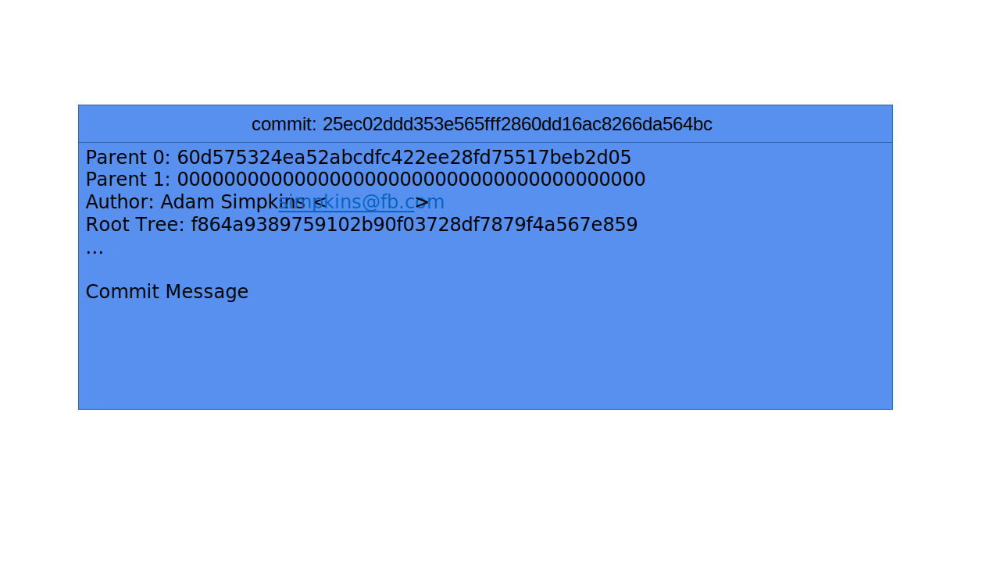
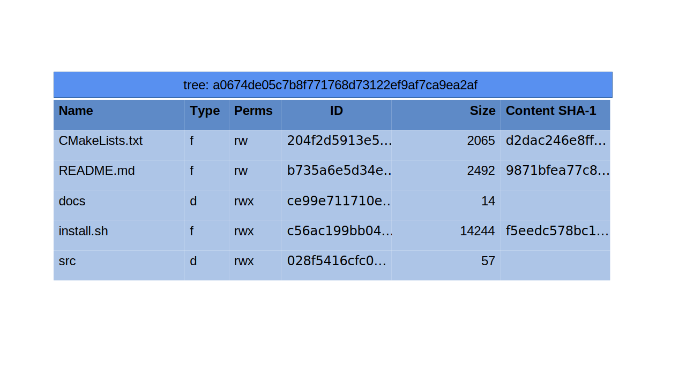
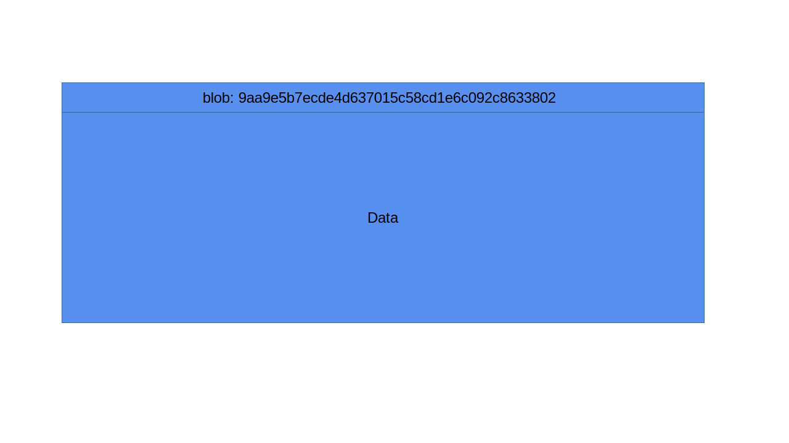

# Data Model

EdenFS is designed to serve file and directory state from an underlying source
control system. In order to do this, it has two parallel representations of the
state: one that tracks the original immutable source control state, and one that
tracks the current mutable file and directory structure being shown in the
checkout.

# Source Control Model

EdenFS's model of source control state mimics the model used by
[Git](https://git-scm.com/) and EdenSCM. The source control repository is viewed
as an object storage system with 3 main object types: commits, trees (aka
directories), and blobs (aka files).

The Git documentation has an
[in-depth overview of the object model](https://git-scm.com/book/en/v2/Git-Internals-Git-Objects).

EdenFS expects to be able to look up objects by ID, where an object ID is an
opaque 20-byte key. In practice, both Git and EdenSCM are content-addressed
object stores, where the object IDs are computed from the object contents.
However, EdenFS does not strictly care about this property, and simply requires
being able to look up an object from its ID.

These 3 types of objects are chained together in a
[DAG](https://en.wikipedia.org/wiki/Directed_acyclic_graph) to allow
representing the full commit history in a repository. Each commit contains the
ID(s) of its parent commit(s), the ID of the tree that represents its root
directory, plus additional information like the commit message and author
information.

Commit objects are referenced by variable-width identifiers whose meaning is
defined by the concrete BackingStore implementation. For example, in Mercurial
and Git, they're 20-byte binary (40-byte hex) strings. Each mount remembers its
parent root ID across EdenFS restarts.

Tree objects represent a directory and contain a list of the directory contents.
Each entry in the directory has the name of the child entry as well as the
object ID, which refers either to another tree object for a subdirectory or to a
blob object for a regular file. Each entry also contains some additional
information, such as flags tracking whether the entry is a file or directory,
whether it is executable, etc.

Additionally, tree entry objects can also contain information about the file
size and hashes of the file contents. This allows EdenFS to efficiently respond
to file attribute requests without having to fetch the entire blob data from
source control. Note that these fields are not present in Git's object model,
but are available when the underlying data is fetched from an EdenSCM Mononoke
server.

The blob type is the final object type and is the simplest. The blob object type
simply contains the raw file contents. Note that blob objects are used to
represent both regular files as well as symbolic links. For symbolic links, the
blob contents are the symlink contents.

EdenFS's classes representing these source control objects can be found in the
[`eden/fs/model`](../model) directory. The `Tree` class represents a source
control tree, and the `Blob` class represents a source control blob.

Note that EdenFS is primarily concerned about showing the current working
directory state, and this mainly only requires using Tree and Blob objects. In
general, EdenFS does not need to process source control history related
operations, and therefore does not deal much with commit objects.

# Parallels with the Inode State

The classes in `eden/fs/model` represent source control objects. These objects
are immutable, as once a commit is checked in to source control it cannot be
modified, only updated by a newer commit.

In order to represent the current file and directory state of a checkout, EdenFS
has a separate set of inode data structures. These generally parallel the source
control model data structures: a `TreeInode` represents a directory, and its
contents may be backed by a `Tree` object loaded from source control. A
`FileInode` represents a file, and its contents may be backed by a `Blob` object
loaded from source control.
