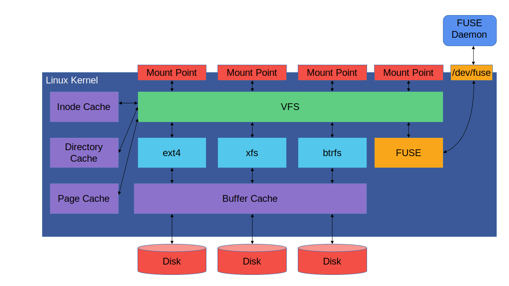
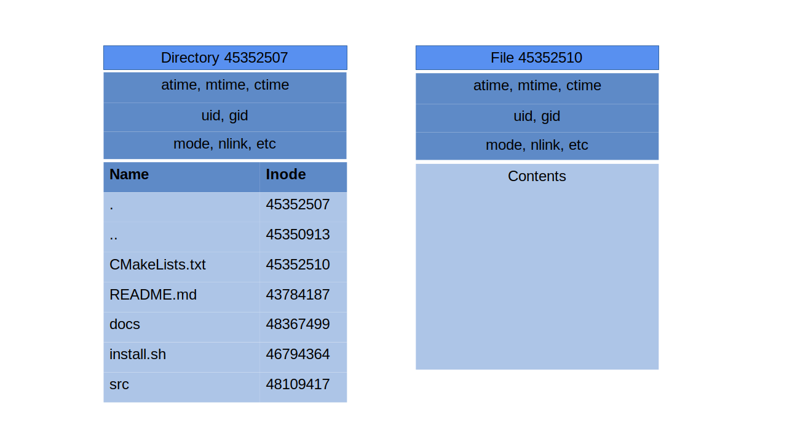
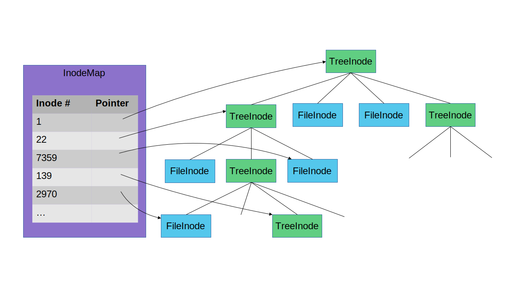
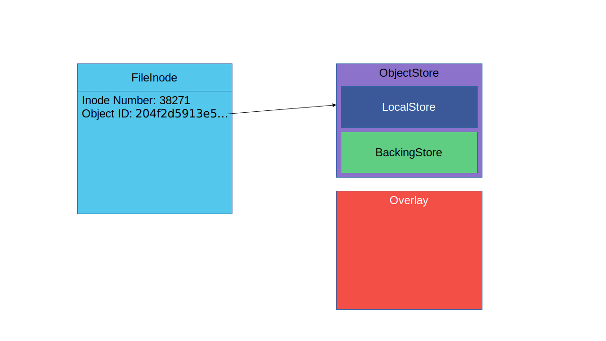
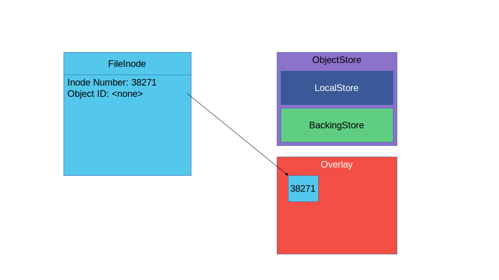
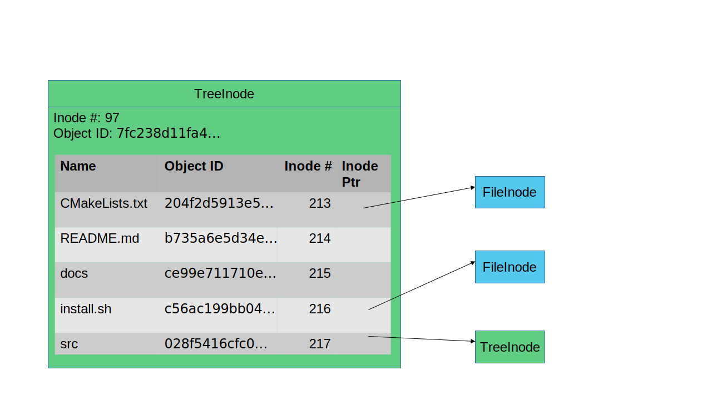

Inodes and the Linux VFS Layer
==============================

EdenFS represents the current file and directory state of a checkout using
[inodes](https://en.wikipedia.org/wiki/Inode).  The inode data model is used by
Linux's internal
[VFS](https://www.kernel.org/doc/html/latest/filesystems/vfs.html) layer.

The VFS layer allows Linux to support many different filesystem
implementations.  Each implementation provides a mechanism for exposing a
filesystem hierarchy to users, regardless of the underlying data
representation.  Linux supports a variety of filesystem implementations for
storing data on disk, such as [ext4](https://en.wikipedia.org/wiki/Ext4),
[btrfs](https://en.wikipedia.org/wiki/Btrfs), and
[xfs](https://en.wikipedia.org/wiki/XFS), as well as implementations that store
data remotely over a network, such as
[NFS](https://en.wikipedia.org/wiki/Network_File_System) and
[CIFS](https://en.wikipedia.org/wiki/Server_Message_Block).

[FUSE](https://en.wikipedia.org/wiki/Filesystem_in_Userspace) is simply another
Linux filesystem implementation.  Rather than storing data on a disk, it calls
out to a userspace process to allow that userspace process to choose how to
store and manage data.  EdenFS uses FUSE to expose checkouts to users on Linux.
On macOS EdenFS uses [FUSE for macOS](https://osxfuse.github.io/), which
behaves very similarly to Linux FUSE and shares the same inode model.

One key aspect of inodes is that each inode is identified by a unique inode
number.  The inode number is what uniquely identifies a specific file or
directory in the filesystem, not a file path.  A specific inode may be present
in the file system at multiple paths (i.e.,
[hard links](https://en.wikipedia.org/wiki/Hard_link)).  Alternatively, an
inode may be unlinked from the filesystem and may continue to exist without a
path as long as there is still an open file handle referring to it.

A inode may be either a regular file or directory, or even other special types
of files such as symbolic links, block or character devices, sockets, and named
pipes.

Each inode contains some common attributes, such as the owning user ID and
group ID, permissions, and file access, change, and modification timestamps.
The remaining inode contents depend on the inode type.  In general a directory
inode contains a list of children entries, with each child entry consisting of
a name and the inode number for that child.  Regular files contain the file
data.

EdenFS Inodes
=============

EdenFS contains two primary classes that represent inode state: `TreeInode`
represents a directory inode, and `FileInode` represents any non-directory
inode, including regular files, symlinks, and sockets.

Both `TreeInode` and `FileInode` objects share a common `InodeBase` base class.
Inode objects are reference counted using the `InodePtr` smart-pointer type.
The [Inode Lifetime document](InodeLifetime.md) describes inode lifetime
management in more detail.

The `TreeInode` and `FileInode` objects are grouped together in a hierarchy:
each `TreeInode` has a list of its children.  In addition there is a separate
`InodeMap` object to allow looking up inode objects by their inode number.

Note that since EdenFS loads file information lazily some children entries of
a `TreeInode` may not be loaded.  When a `TreeInode` object is loaded we know
the names of all children inodes, but we do not actually create inode objects
in memory for the children until they are accessed.

Parent Pointers
---------------

EdenFS inodes currently do maintain a pointer to the parent `TreeInode` that
contains them.  This parent inode pointer is used for a few reasons:
* To determine the inode path so that we can record file change information in
  the journal, since journal events are recorded by path name.
* To materialize the parent directory whenever an inode is materialized.
* To include the inode path in some debug log messages, for easier debugging.

This does mean that EdenFS does not currently support hard links, as we require
that an inode can only have a single parent directory.  Source control systems
generally cannot represent hard links, so hard links can never be checked in to
the repository.  However build systems and other tools do sometimes want to be
able to create new hard links on the filesystem, even if they cannot ever be
committed.  In the future it may be worth relaxing this requirement in order to
support hard links in EdenFS.

Inode Number Allocation
-----------------------

Inode numbers are chosen by the underlying filesystem implementation when files
are created.  In traditional disk-based filesystems the inode number may
represent information about where the data for the inode is stored; for
instance a block ID or an index into a table or hash map.

Since EdenFS only lazily loads file information when it is accessed, EdenFS
does not necessarily know the full file or directory structure when a checkout
is first mounted or when it is changed to point to new commit state.  Therefore
EdenFS assigns inode numbers on demand when an inode is first accessed.  EdenFS
simply allocates inode numbers using a monotonically increasing 64-bit ID.

Note that EdenFS does need to remember the inode numbers that have been
assigned.  This information is stored in the directory state in the overlay.
Note that this means that simply listing a directory does cause it to be
written to the overlay, since we have to record the inode numbers that
have been assigned to its children.  In this case we will store the directory
in the overlay, but as long as the child contents are still the same as the
original source control tree we will record the source control tree ID in the
overlay too.

Inode Materialization
=====================

One key attribute of EdenFS inodes is whether the inode is
[materialized](Glossary.md#materialized--non-materialized) or not.

Materialization is perhaps most easily described by explaining the
non-materialized state first: an inode is not materialized if we have a source
control object ID that can be used to fetch the inode contents from the
underlying source control repository.

When a new EdenFS checkout is first cloned all of its inodes are
non-materialized, as they all correspond to a source control tree or blob.
EdenFS only needs to store the 20-byte source control object ID, and when it
needs the file or directory contents it can fetch it from the source control
repository using the `ObjectStore` API.

However, if a file is modified we can no longer fetch the contents from source
control.  EdenFS then removes the source control object ID from the inode
information, and instead stores the file contents in the
[overlay](Glossary.md#overlay).

`FileInode`s are materialized when their contents are updated.
`TreeInode`s are materialized when a child entry is added or removed.  Note
that as discussed above in [Inode Allocation](#inode-allocation) directory
information is often stored in the overlay even when the directory is
technically not materialized so that we can track the inode numbers that have
been allocated to the directory children.

Even if the file is later modified to have its original contents again
EdenFS may keep the file materialized, as we do not have an efficient way
to determine that the contents now correspond to an existing source control
object ID again.  EdenFS may de-materialize the file later during a subsequent
checkout or commit operation if it detects that the file contents are the same
as the object at that location in the newly checked out commit.

Note that an inode's materialization state is orthogonal to the
[Loaded / Unloaded](#loaded--unloaded) state.  All 4 possible combinations of
loaded/unloaded and materialized/non-materialized states are possible.
Materialized inodes can be unloaded, and this state is common when EdenFS first
starts and re-mounts an existing checkout that contains materialized inodes.

Additionally, note that whether an inode is materialized is also completely
independent from whether it is "modified" from a source control perspective.
For instance, renaming a non-materialized file to a new location does not cause
it to be materialized, since the file contents still correspond to a known
source control object.  However, from a source control perspective the file
must now be reported as modified.  Operations like `hg reset` that update the
pointer to the currently checked out commit without changing the working
directory state can also result in files that must now be reported as modified
from the current commit, even if they are non-materialized.

Parent Materialization
----------------------

Whenever a file or directory inode is materialized its parent inode must also
be materialized: since the file no longer corresponds to a known source control
object, the parent directory also no longer corresponds to a known source
control tree.  The object IDs in the source control tree fully identify the
contents of each directory entry, so whenever the contents of any directory
change the directory contents itself are effectively modified.

For instance, consider the following representation of a `TreeInode` containing
a number of children entries:

If the `install.sh` file is updated, its `FileInode` is materialized and the
source control object ID is removed from it.  The entry for this child also
must be updated in its parent `TreeInode`, and the source control object ID
must be removed from this parent `TreeInode`:

Note that this process must be done recursively all the way up to the root
inode: the parent `TreeInode` of inode 97 must also be materialized, since one
of its children was materialized.  This materialization process continues
walking upwards to the root inode until it finds a `TreeInode` that has already
been materialized, as it can stop its upwards walk there.
