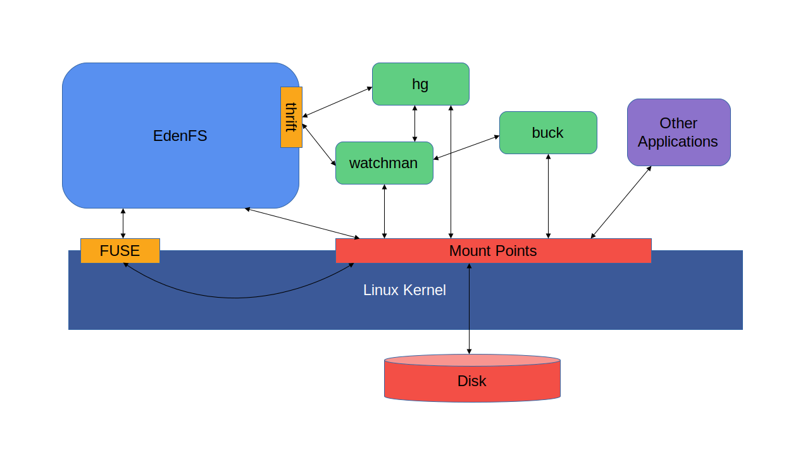
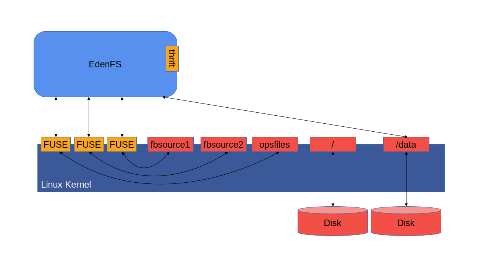
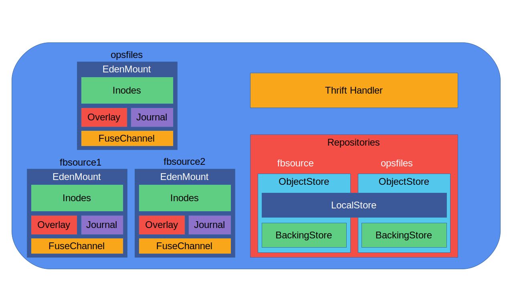

The EdenFS Daemon
=================

EdenFS runs as a normal user space process.  In general each user on a system
will have their own long-lived EdenFS daemon process.  The EdenFS daemon
provides two primary interfaces for other processes to interact with it.

The first of these is the file system interface
([FUSE](https://en.wikipedia.org/wiki/Filesystem_in_Userspace) on Linux,
[NFS](https://datatracker.ietf.org/doc/html/rfc1813)/[macFUSE](https://osxfuse.github.io/)
on macOS, and
[Projected FS](https://docs.microsoft.com/en-us/windows/win32/projfs/projected-file-system)
on Windows), through which it exposes virtual filesystems.  Other
applications can interact with files and directories in EdenFS checkouts just
like they would on any other normal local filesystem.  This allows other
applications to transparently interact with EdenFS checkouts without needing
any specific knowledge of EdenFS.

Additionally, EdenFS also exposes a thrift interface.  This allows EdenFS-aware
applications to perform additional functionality that is not available through
standard filesystem APIs.  For instance, EdenFS exposes thrift APIs for
checking out a different source control commit, comparing the current file
system state to a given source control commit, efficiently performing glob
queries against file names, getting file hashes, etc.

Mount Points
============

A single EdenFS daemon can manage multiple checkouts for the user.  On Linux
and Mac each checkout is exposed as a separate filesystem
[mount point](https://en.wikipedia.org/wiki/Mount_%28computing%29).  On
Windows, each checkout is a separate ProjectedFS virtualization root.

When the user clones a new checkout, EdenFS creates a new file system mount
point to expose the checkout.  To remove a checkout users should use the
`edenfsctl rm` command: mount points cannot be removed normally with `rmdir`,
but must instead be unmounted.

The following diagram shows a high level picture of an EdenFS daemon running on
a system, serving 3 different checkouts, named `fbsource1`, `fbsource2`, and
`opsfiles`:

Each red box represents a mount point, the kernel's interface for
exposing a file system to user-space applications.  The orange "FUSE" boxes
represent the FUSE interface between the EdenFS daemon and the kernel for
processing file system requests for a particular mount point.  Two additional
mount points mapping to local on-disk file systems are also shown, at `/` and
`/data`.  In this diagram EdenFS stores its own state in a directory under the
`/data` partition, which it accesses through the `/data` mount point.

Note that EdenFS could have been implemented by having a single daemon per
checkout, instead of a single daemon per user.  There are various trade-offs
between these two design choices.  Using a daemon per checkout would have
potentially provided better isolation between checkouts--if something goes
wrong with the EdenFS daemon managing one checkout then other EdenFS checkouts
can still continue running normally.  The main factor that led us to choose a
single daemon per user is that this allows better sharing of resources between
checkouts.  If users have multiple different checkouts of the same underlying
repository we can more easily share source control state across all checkouts,
and avoid re-fetching and keeping multiple copies of data in memory.  Having a
single daemon per user also makes process management and upgrades slightly
simpler, as there is only a single process per user to maintain.

High Level Data Structures
==========================

Within the EdenFS daemon there are several different high level components.

In the code there is a single `EdenServer` object that manages all state for
the daemon.  It has a single `EdenServiceHandler` object, which acts as the
thrift service handler, and is responsible for responding to all thrift
requests received over EdenFS's Unix domain thrift socket.

Additionally, there are several data per-[checkout](Glossary.md#checkout) data
structures.  The `EdenMount` class contains all in-memory state for a checkout,
and the `EdenServer` maintains a map of all currently active `EdenMount`
objects.

Each `EdenMount` contains a `FuseChannel` object responsible for handling FUSE
communication with the kernel, a set of inode objects to track the current
checkout file and directory state, an `Overlay` object that tracks locally
modified files and directories, and a `Journal` that records all recent
modifying file I/O operations.

There is also some per-[repository](Glossary.md#repository) state.  Note that
from EdenFS's perspective, the repository is the location where it fetches
source control data, whereas the checkout is the working directory view that
EdenFS exposes to users.  A user may have multiple checkouts of the same
repository, each providing a different working directory view of the repository
data, potentially with different commits checked out in each.

The `ObjectStore` class provides the internal API that EdenFS uses to fetch
data from a source control repository.  The `ObjectStore` is split into two
components internally: a `BackingStore` that is responsible for actually
fetching data from the repository, and a `LocalStore` class that locally caches
fetched data.  The primary `BackingStore` implementation used by EdenFS is the
`HgBackingStore` class, which fetches data from an EdenSCM repository.  (The
name `HgBackingStore` dates back to before EdenSCM was differentiated from
Mercurial.)  EdenFS also has a `GitBackingStore` implementation that can fetch
data from a git repository.  However, as the git CLI does not currently have
any knowledge of EdenFS this is not particularly usable in practice: while
EdenFS can show a view of a git repository, operations like `git status` or
`git checkout` are not EdenFS aware.

Persistent State Management
===========================

EdenFS stores its own state on local disk, in the EdenFS state directory.  The
default location for this directory depends on your system configuration, but
is often `~/.eden` or `~/local/.eden`. On Windows, this is commonly located at
`C:\Users\<user>\.eden`.

It is possible for a user to run multiple EdenFS daemons if you specify a
different state directory for each daemon.  The state directory path can be
specified with the `--config-dir` parameter to the `edenfsctl` tool.  In
general most users will not need to do this, but it can be useful for
developers in order to run a test version of EdenFS for development, separate
from their main EdenFS instance.

The state directory contains a number of different items:

### `config.json`

This file contains the list of currently configured checkouts.  It contains a
JSON dictionary mapping the absolute path to the checkout to the name of the
EdenFS `clients/` state directory that contains the state for this checkout.

Early on in EdenFS development we stored most configuration as JSON, but we
have since migrated most configuration to
[TOML](https://github.com/toml-lang/toml).  This is the last remaining
configuration file that is still JSON, and eventually its state should probably
be moved into the `config.toml` file below.

### `config.toml`

This file contains other instance-wide EdenFS configuration settings.

### `logs/edenfs.log`

This is the main EdenFS log file.  This contains logs from the EdenFS daemon,
in [Google Logging](https://github.com/google/glog) format:

`LmmDD HH:MM:SS.USECS THREAD FILE:LINE] MSG`

* L:  A 1-character code describing the log level (e.g., E for error, W for
  warning, I for info, V for "verbose" debug messages)
* mm: 2-digit month
* DD: 2-digit day
* HH: 2-digit hour, 24-hour format
* MM: 2-digit minute
* SS: 2-digit second
* USECS: 6-digit microseconds
* THREAD: Thread ID
* FILE: Filename (just the last component)
* LINE: Line number
* MSG: The actual log message

In addition, output from commands spawned by EdenFS will also be directed to
this log file.  In particular, when importing data from EdenSCM the output of
the `eden debugedenimporthelper` command command will be sent to this file.

### `storage/`

This directory primarily contains a cache of imported source control data.

### `clients/`

The `clients` subdirectory contains one subdirectory per checkout managed by
EdenFS.  The `config.json` file listed above contains the mapping between the
absolute paths of checkouts to their `clients/` state directory.

Note that this directory is called `clients/` largely for historical reasons.
Early on in EdenFS development we used the term "client" to refer to a
checkout.  This is one of very few remaining locations where this old
terminology is still used.  Eventually it might be nice to rename this
directory, but we would need to build some tooling to help migrate existing
EdenFS state directories in order to do so.

### `clients/NAME/config.toml`

Inside each checkout state directory the `config.toml` file contains some
details about the checkout configuration.  In particular, this includes
information about the backing repository where source control data for this
checkout can be found.

### `clients/NAME/SNAPSHOT`

This file contains the ID of the source control commit that is currently
checked out in this checkout.  Each time a user checks out a different commit
EdenFS will update this file.

### `clients/NAME/local/`

This directory contains the overlay state for the checkout: information about
files and directories that have been locally modified.

For files that have never been modified, EdenFS knows it can retrieve the file
contents from source control.  Therefore EdenFS normally only need to track a
source control object ID that can be used to fetch the file contents.  However,
once a file has been modified locally there is no longer a source control
object ID that can be used to fetch the file contents.  Therefore EdenFS must
store the full file contents, and it does so in this directory.

Files that have been locally modified are referred to as
["materialized"](Glossary.md#materialized--non-materialized).  Files are
tracked in the overlay if and only if they are materialized.

The Privhelper Process
======================

For the most part EdenFS runs as a normal, unprivileged process with the
permissions of the user that started it.  However, on Linux and Mac mounting
and unmounting directories requires elevated privileges, and cannot be done by
normal users.

In order to overcome this, EdenFS runs as a pair of processes on Linux and Mac:
the main process running as the user, and a privileged helper process running
with root privileges.  The privileged helper process exists only to perform
mount and unmount operations.

In order to start the privhelper process EdenFS must be started as root.  This
can either be done by installing EdenFS as
[setuid](https://en.wikipedia.org/wiki/Setuid) root, or by invoking EdenFS
using `sudo`.  Once EdenFS starts it immediately forks off the privileged
helper process and then drops privileges.  The main EdenFS process can then
send mount and unmount requests to the privhelper process over a Unix domain
socket pair.
