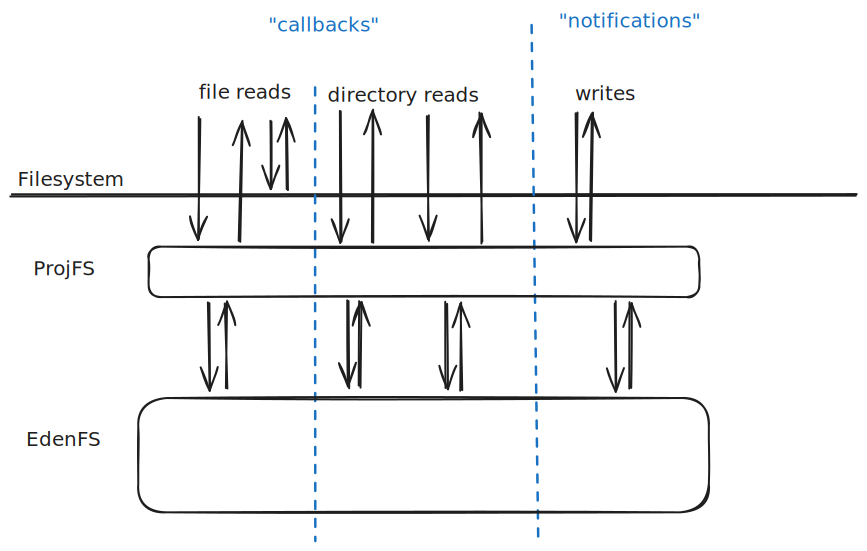
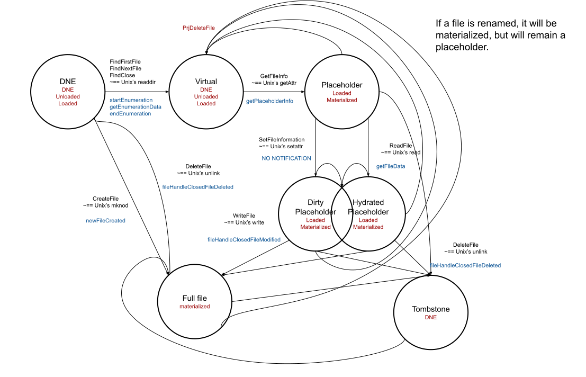
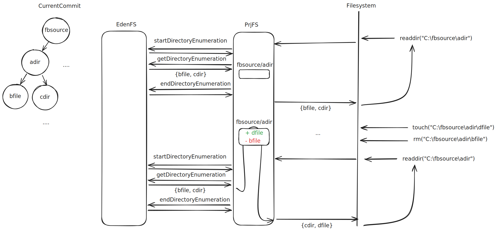
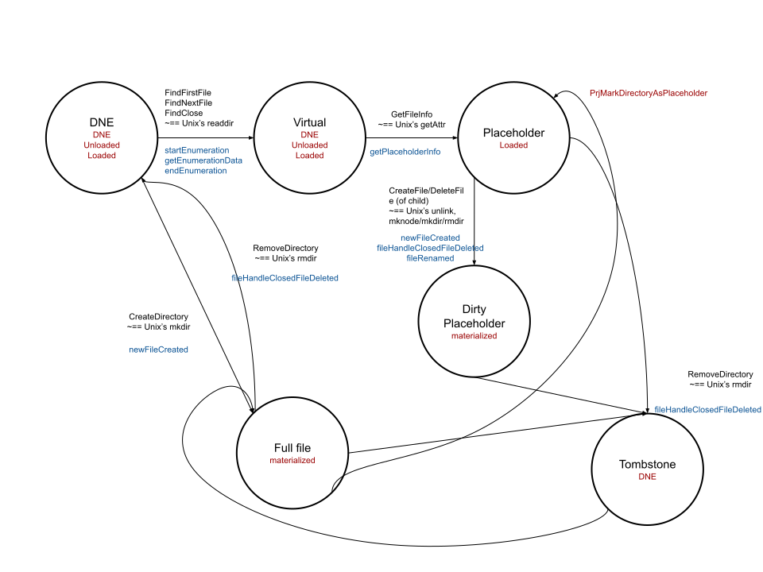
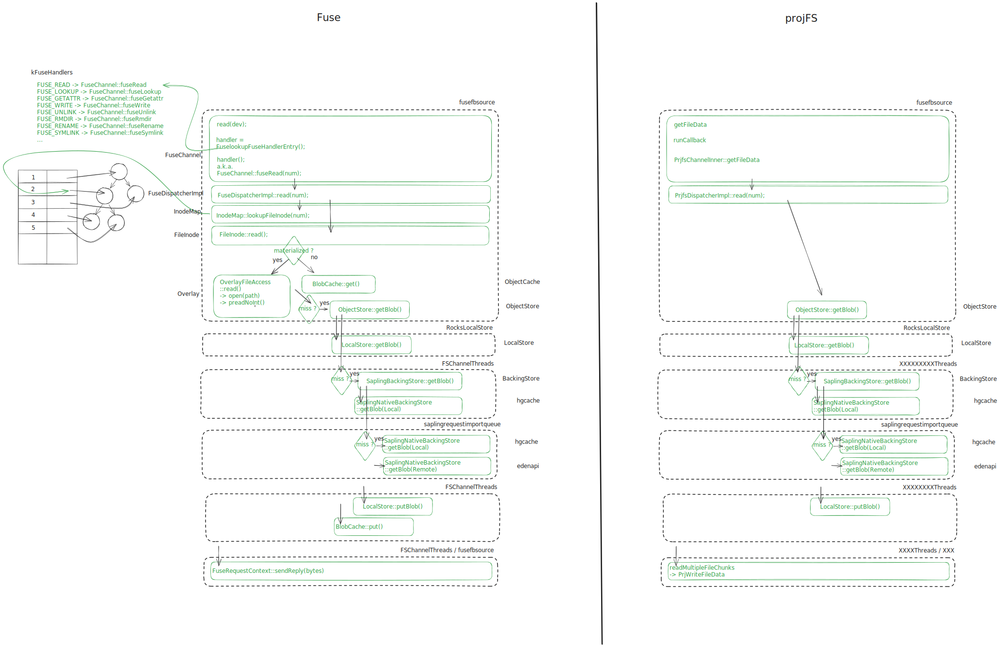
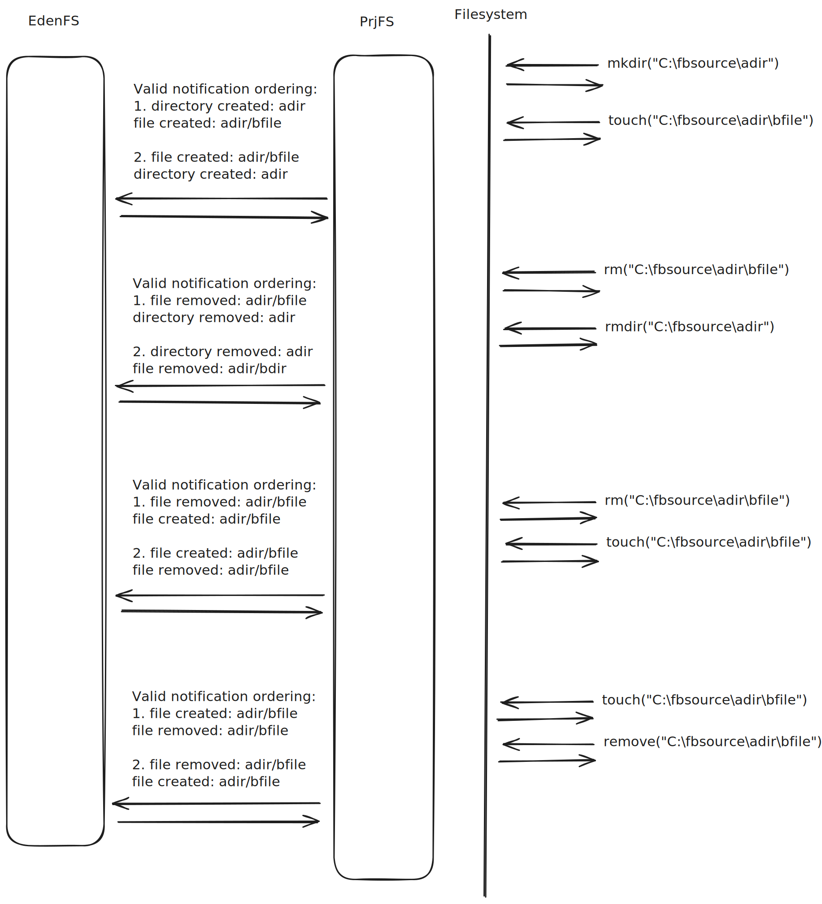

# EdenFS on Windows

On Windows, EdenFS uses Microsoft's [ProjectedFS][PrjFS] which works
significantly differently from [FUSE][FUSE] and [NFS][NFS] that it warrants its
own page. The rest of this document assumes prior knowledge about these two.

First a note on terminology. ProjectedFS is referred to as both ProjFS and
PrjFS.

## History

EdenFS on Windows started in 2018 (EdenFS in general started in 2015).
Initially, we started with writing our own driver (internal link:
https://fb.workplace.com/groups/edenfs/permalink/817851058385128/ - design
internal link:
https://docs.google.com/presentation/d/1e-aF_zTTySBp7wg2MXiBXqE7HBpt3Y6C/edit?usp=drive_link&ouid=102428301256319699008&rtpof=true&sd=true).
But then we learned about ProjFS which was the new hotness at the time
(https://fb.workplace.com/groups/edenfs/permalink/844844032352497/). Since it
seemed like Microsoft was trying to do the same thing we were doing (new
driver), we chose to go with ProjFS so that we would not have to own our own
kernel driver.

## Alternatives

### WinFSP

WinFSP has a Windows-y interface and a FUSE-y interface. The Windows-y one would
likely have better performance, but the FUSE-y one would likely be easier for
EdenFS to integrate with.

This seems like the most promising option.

### WinFUSE

A FUSE like kernel driver for Windows. This one seems to predate WinFSP, and
WinFSP seems to be better supported. WinFSP is likely a better option. However,
WinFUSE hasn't been investigated too thoroughly, so it would be worth digging a
bit more before we declare that.

### NFS

EdenFS already has support for NFS on macOS, so it would be reduce support
burden to have both macOS and Windows EdenFS using NFS.

There is a Microsoft NFS client:
https://learn.microsoft.com/en-us/windows-server/storage/nfs/nfs-overview

However, at the time we investigated (2023) the largest unresolved issue was
performance. The NFS client didn't seem to cache file data after all file
handles to a file were closed. This meant much slower performance than PrjFS.

Additionally, there are a lot of gaps in EdenFS that would need to be filled to
use NFS on Windows - the largest ones are file content storage in the overlay
and supporting a single server for all NFS mounts.

NFS would also come with all many of the same limitations we have on macOS:
funky invalidation, no client pids, etc.
[See the macOS documentation](macOS.md#Limitations-of-NFS) for more.

### SMB

SMB is similar to NFS but was designed for Windows. The Microsoft client would
likely have better support for Windows (better OS caching). However, WinFSP is
more closely designed for the type of filesystem EdenFS is, so would likely be
easier to integrate with. The main issues I would investigate if considering SMB
further is how we would do invalidation and performance.

### WSL2: Windows Subsystem for Linux

This might require users to
[setup](https://learn.microsoft.com/en-us/windows/wsl/about) this subsystem to
use EdenFS. Though likely it would be possible to setup with automation.
Possible certs and network operations would require some work, but that also
seems fixable.

However, there is a lot of redirection here, so performance is a little suspect.
The biggest concern is that it’s
[not recommended](https://learn.microsoft.com/en-us/windows/wsl/filesystems#file-storage-and-performance-across-file-systems)
to work across filesystems. Tools like unity and others that specifically
require windows may not perform well. Note that doc says WSL, but WSL2 seems to
have worse cross Filesystem performance from
[this comparison doc](https://learn.microsoft.com/en-us/windows/wsl/compare-versions),
so it seems the concern would apply to WSL2. It also seems like it does not
support Windows specific workflows well (though maybe that only applies to WSL
and not WSL2). Possible some tools will run into issues.

### Our own kernel driver

Since Windows does support third-party kernel drivers, this is an option. This
would require a large effort to write our own thing, and would incur the extra
risk of maintaining kernel code.

## How does prjFS work - Cached State

ProjectedFS was designed by Microsoft to have no overhead in the common path:
reading an already read or modified file. To achieve this, the state of files is
fully managed by ProjectedFS and is stored directly in the working copy. EdenFS
is only involved when providing the state of files that ProjectedFS is not aware
of.

- internal link: https://internalfb.com/excalidraw/EX304936

A small note about PrjFS: PrjFS refers to files with paths rather than inode
numbers. So when requesting to list a directories contents or read a file it
will ask to read the file by path.

### Reads

The first time a file is being opened, ProjectedFS would first send EdenFS a
[`PRJ_GET_PLACEHOLDER_INFO_CB`][PRJ_GET_PLACEHOLDER_INFO_CB] callback which will
populate a placeholder file in the NTFS backing filesystem by calling the
[PrjWritePlaceholderInfo][PrjWritePlaceholderInfo] API. Similarly, on the first
read, the [`PRJ_GET_FILE_DATA_CB`][PRJ_GET_FILE_DATA_CB] is sent to EdenFS.
EdenFS would then write the file content by calling
[`PrjWriteFileData`][PrjWriteFileData] which will write the file to the working
copy, the file is now considered to be a hydrated placeholder. Subsequent open
or reads will not involve EdenFS as these will be served from the filesystem
directly.

You might be wondering what the term "hydrated placeholder" means. That is a
PrjFS term. The microsoft documentation on those states is
(here)[https://learn.microsoft.com/en-us/windows/win32/projfs/cache-state]. Here
is a state diagram of how files move through these various states:

- internal link:
  https://docs.google.com/drawings/d/1we_gZ2DNWiwcW54a0yZW8Gti9CVg5aykatn7w0cCBks/edit?usp=sharing

The PrjFS state is in black and the EdenFS inode state is in Red. The black text
on the transition shows the Windows filesystem calls that the user would be
doing, and the blue shows the PrjFS calls that ProjFS makes into EdenFS.

### Writes

When a file is written it's contents are first written to disk then EdenFS is
notified about the file changing with
[`fileHandleClosedModified`][fileHandleClosedModified] notification. We will get
into write notifications more in the next section, but for now the important bit
is that EdenFS is notified about file writes after they have finished ( are
observable in the filesystem).

### Directories

Directories are kind of funky. PrjFS does not remember directory contents. Every
time a directory is listed PrjFS will re-request the listing from EdenFS.
ProjectedFS will use three callbacks for directory listing, starting with
[`PRJ_START_DIRECTORY_ENUMERATION_CB`][PRJ_START_DIRECTORY_ENUMERATION_CB] to
open the directory. Reading it is done via the
[`PRJ_GET_DIRECTORY_ENUMERATION_CB`][PRJ_GET_DIRECTORY_ENUMERATION_CB] callback
and finally closing a directory is done via
[`PRJ_END_DIRECTORY_ENUMERATION_CB`][PRJ_END_DIRECTORY_ENUMERATION_CB].
Directories that have been created and thus aren't present in the current
Mercurial commit will not be receiving these callbacks. However, EdenFS is only
responsible for listing the original state of the directory minus local
directory modifications. PrjFS itself stores any local modifications for
directories.

- internal link: https://internalfb.com/excalidraw/EX320539

If EdenFS were to include local modifications for directory listing, it would
confuse PrjFS.

Here's the states for directories:

- internal link:
  https://docs.google.com/drawings/d/1y0ARdOvEs_yMN_5g4XQVcSOhps5_6t74EQYaLxoG6rg/edit?usp=sharing

### Cached State Implications: offline read/writes

**files that have already been read will still be readable after EdenFS is
stopped!** It is also possible to write to certain files when EdenFS is not
running.

To account for this EdenFS has to catchup with any writes to the repo while it
was not running. On unix if EdenFS was not gracefully shutdown, the Overlay
(locally modified files storage) can be corrupted. EdenFS has FSCK (FileSystem
ChecK) to handle that. On the next startup after an abrupt shutdown's FSCK scans
the overlay to check for corruptions and fix them when possible. FSCK on Windows
has been adapted to account for files being modified while offline as well as
checking for corruptions. FSCK runs on **every** EdenFS startup since files may
have been modified while EdenFS was offline anytime not just on abrupt
shutdowns. This makes startup slower on Windows than other platforms.

The inner workings of FSCK on windows are documented in detail in the
[FSCK section](WindowsFsck.md).

### Cached State Implications: EdenFS only Provides committed dat

ProjectedFS is the sole maintainer of locally present files (including modified
ones). One of the implications of this is that EdenFS should only provide file
data and metadata from the current Sapling commit. We mentioned this a bit in
the (directory section above)[#Directories]. User created files should not be
present in directory enumeration results from EdenFS. Surprisingly, renamed
files will always be referred by ProjectedFS from their
[pre-rename path and name](https://github.com/microsoft/ProjFS-Managed-API/issues/68).
For these reasons, EdenFS relies solely on Sapling trees to serve ProjectedFS
callbacks and will not consult the [inode](Inodes.md) state.

This has some tricky implications for invalidation which will be discussed more
below.

- internal link: https://internalfb.com/excalidraw/EX320543

### Cached State Implications: working set size

EdenFS keeps track of the files that the OS knows about. We often refer to the
files the OS knows about as the "working set". EdenFS keeps track of this
working set so that on an `sl checkout` operation, EdenFS can tells the OS if
any of the files it knows about that have changed.

FUSE typically only keeps a file in caches for a short time and notifies EdenFS
when file contents are no longer remembered. That means when FUSE forgets a
file, the file can be dropped from EdenFS "working set". This reduces the work
needed during future checkout operations. But PrjFS doesn't forget files, so the
working set grows and grows and checkout can be quite slow.

To account for this, EdenFS has a background GC on windows that tells PrjFS to
forget about files. EdenFS specifically only tells PrjFS to forget files that
are not locally modified and have not been accessed recently. This helps prune
back the working set, and makes Windows checkout close to Linux performance and
faster than macOS these days.

### Cached State Implications: locally modified file storage

The PrjFS keeps it's own source of truth for file contents. FUSE's caches of
file contents are just that, caches. EdenFS is the source of truth and FUSE
state is derived from thar. However, PrjFS keeps a persistent copy of file
contents which it treats as a source of truth. This means there is a much larger
class of bugs where EdenFS and the filesystem can get out of sync.

To reduce the amount of duplicated state EdenFS maintains, EdenFS does not store
locally modified files contents in the overlay. EdenFS will instead directly
read these out of the repo. EdenFS does keep inodes in memory for all of the
working set, but these are kind of a "cache" what is on disk in the repo. These
inodes are only kept in memory since PrjFS already stores the source truth for
the repo on disk. FSCK rebuilds the entire inode state on startup.

### Cached State Implications: lag

There is some delay in EdenFS knowing the state of files (i.e. EdenFS's inodes
matching what is on disk) since it's notified after they have been modified.
This means EdenFS's view of the filesystem always lags.

While EdenFS on Windows makes little use of the inode state (filesystem reads
serviced directly from commits rather than inodes), inodes are still fundamental
to EdenFS inner working. Particularly all the thrift methods rely on inodes.
`getScmStatus`, `checkoutRevision` or `globFiles` all rely on the inode state as
they care about the working copy state that ProjectedFS doesn't provide.

Since EdenFS only needs to query the inode state while servicing Thrift
requests, EdenFS only needs to make sure that the inode state is caught up with
all the changes to the working copy prior to servicing a Thrift requests.

EdenFS internally has a queue of notifications it needs to catchup with. For
Thrift operations that want to inspect EdenFS's view of the repo, there is a
`SyncBehavior` parameter that can cause EdenFS to process all the notifications
it received before the Thrift call. This is done by simply enqueueing an empty
notification on this serially processed queue of notifications and waiting for
it to be processed. This can make EdenFS's Thrift responses more consistent with
the filesystem. However, there could still be modifications that EdenFS is not
yet aware of which this sync process does not account for.

Since some clients ([Buck][Buck], [Watchman][Watchman]) don't mind if the data
returned is slightly out of date, `SyncBehavior` allows the client to control
how long to wait for the inode to be synchronized with the working copy. Note
that this only guarantees that all the writes made prior to the Thrift request
have been synced up, writes that race with the Thrift query are not guaranteed
to be synced up.

We could add some extra time-delay/settling/cookie(see Watchman) behavior to
EdenFS to try to account for modifications that EdenFS isn't yet aware of, but
this would add extra overhead to all EdenFS Thrift operations. Most the time
users don't notice this, so the overall performance hit may not be worth the
rare edge case.

### Write notifications

Whenever a write operation is performed in the working copy (writing a file,
renaming it, creating a directory, etc), the callback
[`PRJ_NOTIFICATION_CB`][PRJ_NOTIFICATION_CB] is invoked in EdenFS. This callback
is usually invoked after the write operation has taken place so importantly
EdenFS cannot refuse the operation.

The most subtle part about this callback though is that ProjectedFS doesn't
provide any guarantee about the ordering of notifications. For instance, during
a concurrent directory hierarchy creation, a notification on a child directory
may be received prior to the notification of its parent directory! The same is
true for file and directory removal.

- internal link: https://internalfb.com/excalidraw/EX320542

EdenFS use to do the naive thing to handle file modification notifications: try
to directly apply the modification to the inode state. Like a file was removed,
ok try to unlink that file from the inode hierarchy.

In our examples above we can see where this could cause trouble.

1. If EdenFS hears about a file's creation before it's parent directories, when
   EdenFS tries to add the new file to the parent directory inode, the directory
   inode won't exist. If EdenFS just said shrug (failed and ignored the
   confusing notification), the file would never get added to the inodes and it
   would be missing from `sl status`. So EdenFS needs to create any missing
   parent directories.

2. If EdenFS's hears about a directory removal before a file removal. When
   EdenFS hears about the directory removal the directory may be non empty. So
   EdenFS needs to recursively delete directories if necessary. When EdenFS goes
   to remove the file from the parent inode won't exist. EdenFS needs to handle
   this gracefully. EdenFS should realize it has already done the work to remove
   the file and basically just do nothing.

3. If a file exists and EdenFS's hears about creation of a file before removal
   of that same file, when it sees the creation it will think there is nothing
   to do since the file exists. Then when it gets the removal it will remove the
   file. So EdenFS will end thinking the file does not exist and the file would
   show up as removed in `sl status` despite existing on disk.

4. If a file does not exist and EdenFS's hears about the removal before the
   creation, when it sees the removal it will think there is nothing to do since
   the file does not exist. Then when it sees the creation, EdenFS will create
   the file. So EdenFS will end up thinking the file exists when it does not
   exist on disk. The file will showup in `sl status` as modified despite the
   file not being present on disk.

So how does EdenFS correctly account of all these things and properly process
notifications?

EdenFS handles all of the notification serially in a single background thread.
The handling of these notifications is done in a non-blocking manner in EdenFS.
On receiving a notification, EdenFS will first inspect the state of the
file/directory the notification refers to. Then EdenFS will update the inode
state accordingly: for a missing file, it will remove it from inode hierarchy,
for a missing directory, the entire directory hierarchy will be removed, etc.
Meaning rather than trust the contents of a notification, EdenFS just treats
notifications as "something changed around this file". EdenFS just tries to
match it's inode state to the state of disk around the modified file/directory.

## Invalidations

If during a checkout operation a file that was previously read changes, EdenFS
needs to tell PrjFS that file has changed, so that PrjFS does not continue
providing the old file contents to users. We call telling the OS that a file
changed "invalidation". This is done via the the [PrjDeleteFile][PrjDeleteFile]
API. For directories, as mentioned above PrjFS does consult EdenFS for most
reads. However PrjFS only consults EdenFS for directories present in the current
commit and never for user created directories. So EdenFS still needs to
invalidate directories if there are files added or removed during checkout.
EdenFS needs to add a placeholder to previously locally created directories if
the directory either changes or is present in the destination commit during the
checkout operation. This is done via the
[PrjMarkDirectoryAsPlaceholder][PrjMarkDirectoryAsPlaceholder] API. While
Microsoft's documentation doesn't document this API to be used for invalidation,
VFSForGit is using it to perform invalidation in the same way as EdenFS.

Invalidation has been the source of several bugs in EdenFS. Starting with
passing a GUID that doesn't match the GUID of the root folder in
`PrjMarkDirectoryAsPlaceholder`. This sometimes leads to Windows throwing a "The
provider that supports file system virtualization is temporarily unavailable"
error. To avoid this issue, EdenFS stores the GUID used when creating a mount in
the mount configuration, and will use the same GUID for the whole lifetime of
the working copy.

Calling `PrjMarkDirectoryAsPlaceholder` on a non-populated directory will lead
to recursive callbacks which have at times deadlocked EdenFS due to trying to
recursively take already held locks.

`PrjDeleteFile` and [`PrjUpdateFileIfNeeded`][PrjUpdateFileIfNeeded] can only be
used on an empty directory, or they will fail claiming that the directory isn't
empty. While this is expected for the former, this is surprising for the latter.
During callbacks, ProjectedFS passes the relative path of the file as well as
the [`PRJ_PLACEHOLDER_VERSION_INFO`][PRJ_PLACEHOLDER_VERSION_INFO] stored in the
placeholder (which can be populated via `PrjWritePlaceholderInfo`), and EdenFS
walks the Sapling trees to serve the callback. An optimization would be shortcut
this walk by storing the tree/file ID in the placeholder and using it to obtain
the same data as the walk. Unfortunately, due to `PrjUpdateFileIfNeeded` not
being able to update the placeholder of directories containing untracked files,
placeholders would become out of date after checkout operations, rendering them
unusable.

Today there are some issues with invalidation which can get out of sync with the
state of the repo on disk.

There are a few facts that add up to currently allow EdenFS to get out of sync:

1. If PrjFS has a placeholder for a file (hydrated or not) - i.e. knows about
   the file at all, EdenFS will invalidate that placeholder.
2. EdenFS first attempts to invalidate a file and then updates it's inode state.
   If files have not been modified. If the invalidation fails then inode updates
   don't happen.
3. Invalidating a file will fail if another process has a file handle open for
   that file. Invalidation fails for similar reasons to file regular removes
   failing if another process has that file open on Windows.
4. checkout will still succeed if invalidations fail.
5. File reads are served from committed data rather than inodes.

So let's say that a file is an un-hydrated placeholder and there is an open file
handle to that file (in reality it's usually Unity holding open the file). Now
say that file's contents should change as a result of a checkout operation. 1
Tells us that EdenFS will attempt to invalidate the file because it is a
placeholder. 3 tells us that invalidation will fail due to the open file handle.
2 tells us the inode state will not be update to the next commit. 4 tells us
that the checkout operation will still succeed and the currently checked out
commit will be updated. 5 tells us the next time the file is read the contents
will be read from the new commit since it has not been read before (u-hydrated).
At this point EdenFS is out of sync with the file system . The inode for the
file has old commit contents. The file on disk has the new commit contents. The
contents on disk are still correct, but the file will spuriously show up in
`sl status`.

However, we can construct a state where the contents will be incorrect. Let's
say a file is renamed but is still an un-hydrated placeholder. Let's say the
original file is removed or modified in a checkout operation. When the file is
read after the checkout, EdenFS will provide the file contents of the original
file in the new commit since PrjFS asks for files by name and EdenFS serves data
out of commits. So the result of the read will be the modified contents or an
error saying that the file does not exist. This behavior diverges from unix
behavior and is likely undesired.

So what can we do to fix this? Well we have to change one of the 5 ingredients.

1. Putting aside how we know if a file is hydrated vs un-hydrated. We could
   consider not invalidating un-hydrated placeholders, but still updating their
   inode state and only invalidate hydrated ones. However, there might still be
   cached data about non hydrated placeholders on disk like the file size. So we
   still need to invalidate regular placeholders. It's possible the parent
   directory invalidation could be sufficient so there could be something here,
   but it's unclear.
2. We could make EdenFS unconditionally update inodes. This is similar to the
   above idea. However, if we did this for all files it would result in inode
   state being updated for hydrated/materialized files when the filesystem state
   is not. So we could only consider this option for un-hydrated placeholders.
3. We can't change this, it's a Windows thing.
4. We could make checkout fail when any invalidation fails. However, the reason
   checkout does not fail to day is that it would mean checkout would frequently
   fail when file handles are open. We want checkout to be able to gracefully
   handle file handles being open because they are open so frequently (most
   checkout operations?). However, building in a "succeeded but could not update
   files" state to `sl`, and providing users a way to resolve the issue would be
   a better user experience.
5. We can't read from inodes instead of committed data or we will confuse PrjFS.
   However, when a file is first listed we could provide version info for that
   file (i.e. commit). Then when the file is read we can read the contents from
   that commit rather than the currently checked out commit. This solution would
   be tricky for directories though. Adding in this version information to
   placeholders would make `PrjUpdateFileIfNeeded` fail. So we might not be able
   to store version information for trees and only files which could still lead
   to some sync issues.This would cause file contents to be not updated on disk
   more frequently. So we probably would want to combine this solution with the
   one laid out in 4 above.

### End-to-end request flows

- internal link:
  https://docs.google.com/drawings/d/1kle4mG-a7vBBZkHk_G6Fj4baFG76TMopJkFw01Rmm2w/edit?usp=sharing

## Pitfalls and caveats

### Invalidation

See [above](#Invalidations), invalidation is really tricky, and this can lead to
spurious files in `status` and files being out of sync inside EdenFS and on
disk.

### Renaming directories

Due to the way ProjectedFS tracks the state of the working copy, it
unfortunately doesn't support renaming directory placeholders. This has been a
source of complaints from users, and the best remedy has been to teach them to
use `hg mv` instead of a plain `mv`.

### EdenFS can't prevent writes

As write notifications are being sent after the write to the working copy has
occurred, EdenFS can thus not deny them and needs to honor it. In particular,
this means that EdenFS cannot prevent writes to its magic .eden/config file.

### Offline writes

See [above](#Cached-State-Implications:-offline-read). Files can be written when
EdenFS isn't running, so that must be handled on every startup. It also can be
confusing to users that they can partially use their repo (write to it), but
Sapling operations/buck operations will fail.

### Lag

See [above](#Cached-State-Implications:-lag).

### Symlinks

Older versions of PjFS don't support symlinks and only recently (2024) were some
large bugs patched in PrjFS symlink handling.

## PrjFS documentation

[PrjFS]:
  https://docs.microsoft.com/en-us/windows/win32/projfs/projected-file-system
[FUSE]: https://en.wikipedia.org/wiki/Filesystem_in_Userspace
[NFS]: https://datatracker.ietf.org/doc/html/rfc1813
[NTFS]: https://en.wikipedia.org/wiki/NTFS
[PRJ_GET_PLACEHOLDER_INFO_CB]:
  https://docs.microsoft.com/en-us/windows/win32/api/projectedfslib/nc-projectedfslib-prj_get_placeholder_info_cb
[PRJ_GET_FILE_DATA_CB]:
  https://docs.microsoft.com/en-us/windows/win32/api/projectedfslib/nc-projectedfslib-prj_get_file_data_cb
[PrjWriteFileData]:
  https://docs.microsoft.com/en-us/windows/win32/api/projectedfslib/nf-projectedfslib-prjwritefiledata
[PrjWritePlaceholderInfo]:
  https://docs.microsoft.com/en-us/windows/win32/api/projectedfslib/nf-projectedfslib-prjwriteplaceholderinfo
[PRJ_NOTIFICATION_CB]:
  https://docs.microsoft.com/en-us/windows/win32/api/projectedfslib/nc-projectedfslib-prj_notification_cb
[Buck]: https://buck.build
[Watchman]: https://facebook.github.io/watchman/
[PrjDeleteFile]:
  https://docs.microsoft.com/en-us/windows/win32/api/projectedfslib/nf-projectedfslib-prjdeletefile
[PrjUpdateFileIfNeeded]:
  https://docs.microsoft.com/en-us/windows/win32/api/projectedfslib/nf-projectedfslib-prjupdatefileifneeded
[PRJ_START_DIRECTORY_ENUMERATION_CB]:
  https://docs.microsoft.com/en-us/windows/win32/api/projectedfslib/nc-projectedfslib-prj_start_directory_enumeration_cb
[PRJ_GET_DIRECTORY_ENUMERATION_CB]:
  https://docs.microsoft.com/en-us/windows/win32/api/projectedfslib/nc-projectedfslib-prj_get_directory_enumeration_cb
[PRJ_END_DIRECTORY_ENUMERATION_CB]:
  https://docs.microsoft.com/en-us/windows/win32/api/projectedfslib/nc-projectedfslib-prj_end_directory_enumeration_cb
[PrjMarkDirectoryAsPlaceholder]:
  https://docs.microsoft.com/en-us/windows/win32/api/projectedfslib/nf-projectedfslib-prjmarkdirectoryasplaceholder
[PRJ_PLACEHOLDER_VERSION_INFO]:
  https://docs.microsoft.com/en-us/windows/win32/api/projectedfslib/ns-projectedfslib-prj_placeholder_version_info
