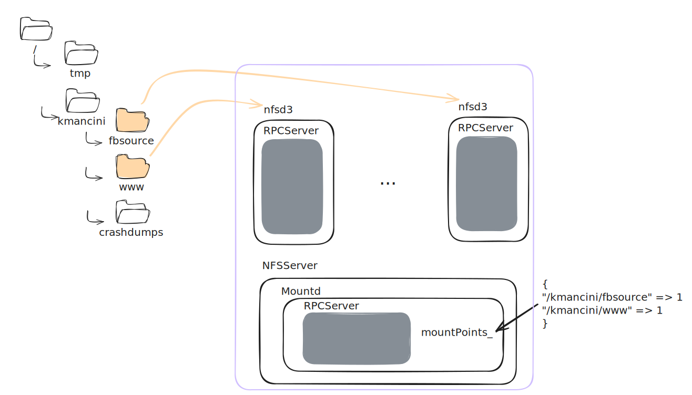
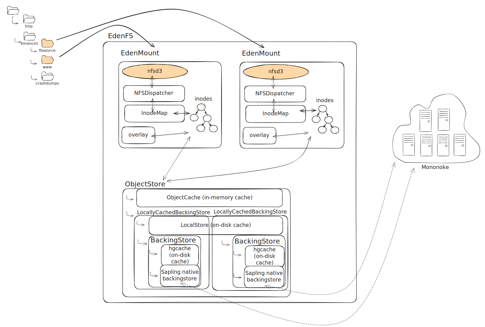
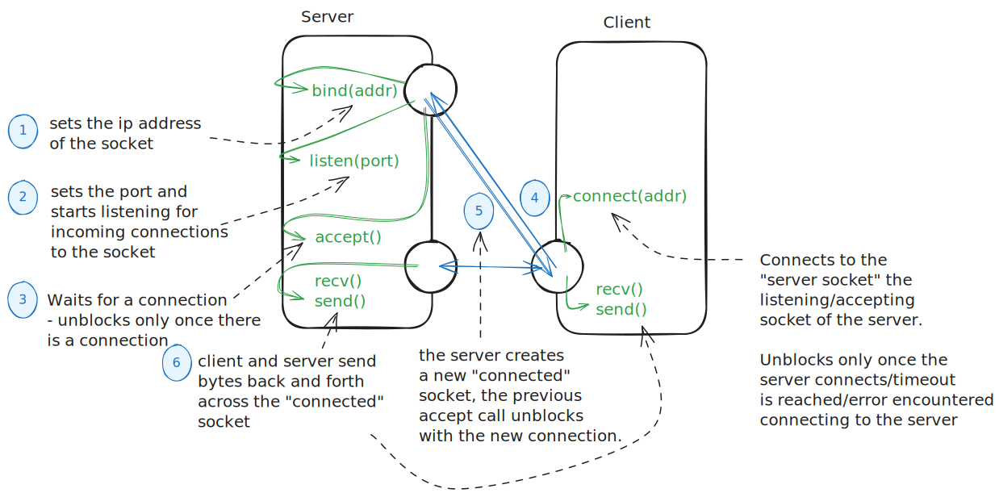
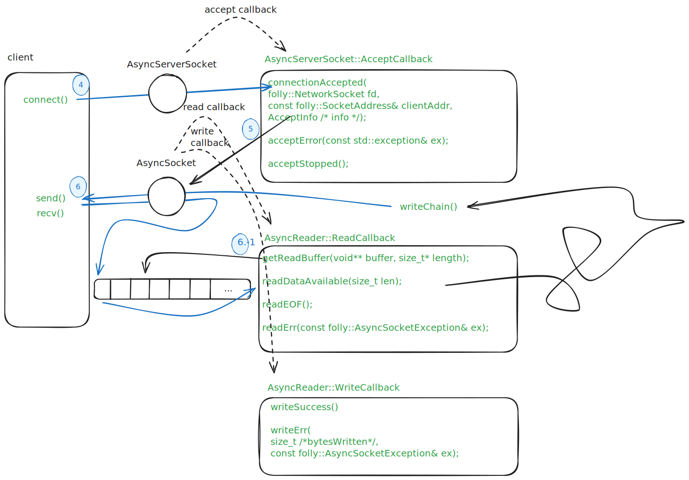
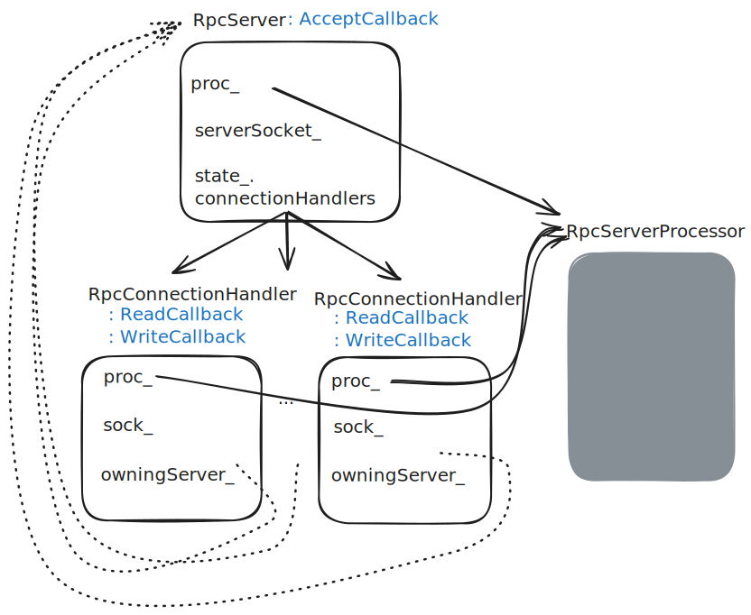
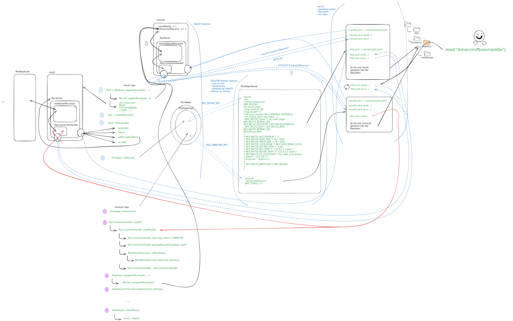
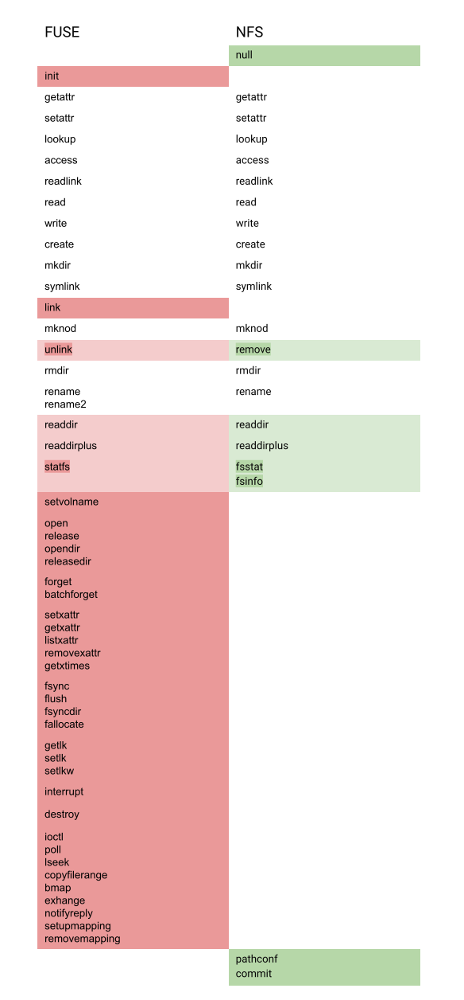

# EdenFS on macOS

On macOS EdenFS uses NFS to talk with the kernel rather than FUSE (used on
Linux) or ProjectedFS (used on Windows).

EdenFS is an NFSv3 server.

The NFSv3 protocol is described in detail here:
https://www.ietf.org/rfc/rfc1813.txt

The protocols for mounting an NFS mount on macOS and Linux:

- macOS is described
  [here](https://opensource.apple.com/source/NFS/NFS-150.40.3/mount_nfs/nfs_sys_prot.x.auto.html).
- Linux is simply described in the
  [man 2 mount](https://man7.org/linux/man-pages/man2/mount.2.html?fbclid=IwZXh0bgNhZW0CMTEAAR3Xuqlrhltn1DYSlshHNYHQylduHobiDrpTnMArnXbcWpW9WzFKhU_MIZA_aem_SMlPP-c0yZ-erlkIz90gkA)
  page.

## History

Previously, EdenFS spoke FUSE on macOS. Specifically EdenFS relied on the
macFUSE (previously osxfuse) kernel extension: https://osxfuse.github.io/.

Apple deprecated third party kernel extensions and has made them harder and
harder to use. The reasoning behind deprecation is that running third party code
in the kernel is risky. Kernel code has special permissions and capabilities.
macs are safer to use if only first party (Apple owned) kernel code is run.
macFUSE is a third party kernel extension, so it is subject to this deprecation.

macFUSE can still technically be used today, but doesn't suit our needs anymore.
macFUSE is no longer used by any EdenFS users. As of 11.4 third party kernel
extensions were no longer usable in automation (i.e. Sandcastle/CI). This is
because using kernel extensions requires clicking some buttons as of 11.4 which
is very difficult to do in automation.

As of Ventura, third party kernel extensions require turning off SIP, which is
unsafe and prohibitive for developers. So we force migrated everyone to NFS on
Ventura.

### Other kernel integration options

#### NFS v4

NFSv4 is faaaaar more complicated than v3, so v3 was a lot easier to write and
maintain.

Here is the NFSv4 protocol spec: https://datatracker.ietf.org/doc/html/rfc7530.
Note 323 pages to v3's 126 pages.

There are benefits to v4 like:

- extended attribute (xattr) support (sha1 through the filesystem)
- improved security
- volatile file handles for better invalidation
- open and close procedures
- multi procedure requests (many getattrs together in the same request)

but also known issues with v4:

- serialized open calls (open calls can only run for one file at a time)
- leases are poorly supported. If you use leases with NFSv4 and your computer
  goes to sleep, you have to remount your repo.

#### NFS but with Ganesha

Instead of directly implementing the NFS protocol and directly talking to the
OS, EdenFS could integrate with Ganesha. The NFS protocol is simple enough that
we chose to directly integrate as it gave us better control of our destiny.

Ganesha might also have been necessary if we could not directly point the NFS
client at a specific port for the NFS server. If we were using NFS in the model
where there is one NFS server on a machine ([see more on that here](#RpcBind)),
then we would have to integrate with Ganesha to avoid clobbering other servers.

Ganesha also has some limitations like no NFSv4 xattr support.

#### SMB

We briefly considered using SMB instead of NFS, but chose NFS due to its Unix
first support (SMB is Windows first).

#### FileProvider

We considered FileProvider, but decided against it because it uses fsevents.
From our experience with Watchman we know that with our repo sizes fsevents
frequently drops events. From talking with the Apple FileProvider team this
results in FileProvider scanning all the locally populated files (files that
have been accessed before) which would be slow and problematic for repos of our
size. We also know that FSEvents does not have strong ordering guarantees
(notification about changes can come out of order)so we would be likely to have
similar race condition bugs that we have needed to solve on the ProjectedFS
side.

More details available internally:
https://fb.workplace.com/groups/edenfs/permalink/1931586983678191/

#### FSKit

FSKit is fairly new (introduced in 2024). We have not thoroughly investigated
FSKit, but it is worth investigating to see if we could address some of the
downsides of NFS without taking on too many new ones.

## Limitations of NFS

1. **xattrs**. We use NFSv3. NFSv3 has no support for extended attributes (also
   called xattrs). Apple (i.e. xcode, finder, ...) sometimes likes to store
   metadata about files in xattrs. This can make things fail. Like copying files
   in finder. We could migrate to NFSv4. However, there are other costs. We know
   Ganesha also does not have support for xattrs anyway. The macOS NFS client
   support for xattrs has not been fully investigated. Rather than getting sha1s
   through the filesystem with xattrs like we support for FUSE, they should get
   sha1s through EdenFS's thrift interface. - internal link:
   https://fb.workplace.com/groups/edenfsmacos/permalink/1224293584843497/

2. **no client pid**. macFUSE had the pid of the client making the filesystem
   request in the header. So we could easily track who was responsible for which
   file accesses. This allowed us to pinpoint crawlers and other pathological
   clients easily. Now we rely on crawl detection (uses lsof to sample processes
   with open file handles), and `fs_usage` to monitor file system accesses.

3. **Tricky invalidation**. During a checkout EdenFS updates its internal
   representation of the repo to a new commit and then needs to tell the kernel
   to drop any caches of stale file contents. NFS has no direct way to do this.
   EdenFS uses a no-op chmod to get the NFS client to notice that caches are
   stale and drop data. Meaning that EdenFS chmod's the parent directories of
   any files that changed during checkout with the same permissions that they
   currently have. This causes the NFS clients to make an NFS setattr request
   back to EdenFS. In the response of that request, just like in the response of
   any NFS request, EdenFS returns attributes about the directory. NFS will
   notice that the attributes have changed since the last time it queries this
   directory and drop all caches about the directory and it's entries. We use a
   chmod because it is a "write" operation so it is something that can not be
   done without interacting with EdenFS, to force the NFS client to notice that
   something has changed about the directory. However, there are reports of
   stale content being seen after checkout. This may not be working reliably. -
   internal link:
   https://fb.workplace.com/groups/rn.support/permalink/26135272476094687/

4. **readdir**. NFS's readdir procedure is very limiting. The returned data
   includes basically only the names of the entries in that directory.
   Importantly the types of the entries are missing. As a result of this,
   instead of a single readdir most clients have to do a readdir and then n
   lookup and getattr calls for each of the entries. This can seriously hurt the
   performance of crawling the repo. Buck2 ran into this performance issue. We
   introduced EdenFS's `readdir` Thrift endpoint as a work around for this
   issue. This readdir endpoint allows clients to make a single call into EdenFS
   for readdir rather than n. Additionally, the Thrift API has the benefit of
   avoiding loading inodes. `sl checkout` is O(loaded inodes), so keeping the
   number of loaded inodes lower also improves the performance of checkout.
   Tools that run into perf issues with directory scanning should use the Thrift
   `readdir` endpoint instead.

5. **No forget calls**. In FUSE once a file is closed the kernel can send forget
   calls. This tells EdenFS that the kernel has forgotten all the information it
   knows about a file. It's like the file had not been read. This allows EdenFS
   to unload inodes. Checkout is O(loaded inodes) so this helps keep the
   checkout working set size small. Additionally, it allows EdenFS to free up
   memory and disk space for files that it does not need to keep track of any
   longer. NFS never tells us when a file has been forgotten. This means the
   number of inodes grows unboundedly. To mitigate this we implemented
   background garbage collection for NFS. We unload any unlinked inode that has
   not been recently accessed after a checkout operation. Unlinked inodes are
   ones that are not reachable from the root. Meaning they were deleted by a
   user or by a checkout operation. This helps EdenFS bound memory and disk
   usage. However for files that are not changing (i.e. not replaced in
   checkout) once they are loaded they stay loaded. This means EdenFS's number
   of loaded inodes stays higher on macOS than other platforms. We could improve
   this by garbage collecting linked inodes that are very stale (we already do
   this on Windows), so would just need to port the logic.

6. **disconnected mounts hang**. If EdenFS crashes, IO in FUSE repos will return
   ENOTCONN errors. However, IO in NFS mounts will hang. This means that our
   tools for detecting and remediating EdenFS crashes need to avoid IO in the
   repo or spawn a separate process to do that IO which can be killed. This
   makes our NFS tests a lot more likely to hang than our FUSE ones as well, as
   stray IO in a broken EdenFS mount can cause the test to hang.

## macOS NFS idiosyncrasies

- The FUSE client and NFS client cache data differently. This means that
  different benchmarks may perform slightly better on NFS or FUSE depending on
  the benchmark. But generally performance on macOS is pretty close between the
  two (perf is better for FUSE than NFS on linux). When we rolled out NFS perf
  impacts across the board were pretty much a wash.
- The macOS NFS client has different behavior when EdenFS is not responsive. NFS
  will send a popup to the user to notify them if EdenFS NFS is not responsive.
  FUSE does not have such a notification. There is a response code in the NFS
  protocol called JUKEBOX_ERROR. The intention of this is "I can't respond now
  try again later". EdenFS does not currently use these. Possible that
  JUKEBOX_ERROR could reduce the popups.
- When a file is removed while a process has an open handle to that file, NFS
  moves the file to a temporary .nfs-xxxx-xxx file.
- When using the NFSv3 protocol, sometimes NFSv4 requests are sent instead of
  NFSv3 ones. EdenFS handles that gracefully (telling the client it's sending
  nonsense), and the client seems to recover fine.
- macOS NFS client does not support close-to-open guarantees as the spec says it
  should. close-to-open means that if an open happens after a close the open
  should see the state of the file after the close. On linux we used this for
  invalidation. i.e. EdenFS would open and close files after they were updated
  during checkout and the Linux client would pick up the new contents for any
  future opens. But the same is not true for macOS. So we have to use chmod
  instead of open on macOS.
- NFS over UDS is broken.
- Rosetta over caches on non APFS filesystems (uses up disk space causing macOS
  users to run out of disk space faster). This affects both NFS and FUSE.
- macOS is a case insensitive filesystem by default. To match that EdenFS mounts
  are also case-insensitive by default on macOS. Unity also barfs if the
  filesystem is not case-insensitive on macOS, so unity developers have a hard
  dependency on case-insensitivity. macOS has a bit of strange behavior around
  case. macOS will use the first casing used to access a file as the source of
  truth for that file. I was able to repro this on a regular directory on macOS
  as well. So I don't think this is an NFS specific thing, but it didn't seem to
  happen with FUSE. This can trip up some tools. Clang for example has a casing
  check that checks that the casing used in includes matches what is on disk. If
  something accesses a file with non standard casing, then even includes with
  the right casing will trip the check. Developers can turn off this casing
  check or unify casing in all includes of a file across the repo as this makes
  the failure less common.

The behavior of this last one can been repro-ed with this small example:

```
$ ls adir/BDIR/cdir
...
$ realpath adir/bdir/cdir
.../adir/BDIR/cdir
```

On the server the file path is actually `adir/bdir/cdir` (lower case). If you
instead list the dir with lowercasing (matching the server casing) first, then
the results are as expected.

```
$ ls adir/bdir/cdir
...
$ ls adir/BDIR/cdir
...
$ realpath adir/bdir/cdir
.../adir/bdir/cdir
```

## Operation Tips

- Most of the NFS mount configuration is in options on the mount call. However,
  there is also a system wide config file on macOS. See man
  [nfs.conf](https://www.manpagez.com/man/5/nfs.conf/osx-10.6.php?fbclid=IwZXh0bgNhZW0CMTEAAR1mJKFF0ezKxhQjoURb6uBJ6XFYw91bDbTbg2zI_WBBEiqnvdcJ5yAio2I_aem_esoGC-N6tylGNtCwwIPrIQ).

- macOS keeps some system wide stats that are available in `nfsstat`.

- EdenFS does not know the client pid of the process accessing files. But you
  can use `sudo fs_usage | grep fbsource` to see which processes are accessing
  which files in the repo to look for crawlers.

- You can use wireshark to see the requests coming in and responses going out '
  of the EdenFS NFS server.
  1. install wire shark if you don't have it:
     https://www.wireshark.org/download.html (Katie installed 64 bit one on
     Windows DoD).
  2. start wire shark
  3. point wire shark at your loopback address. "Adapter for loopback traffic
     capture".
  4. type nfs in the filter bar at the top. hit the blue right arrow.
  5. ls and stuff in your NFS repo, requests should start showing up.

## Architecture

### NFS Servers

If a user has n EdenFS mounts, their EdenFS daemon will have n+1 servers running
for NFS. There is one nfsd3 per repo, and then one single mountd. Each of these
servers has an RPCServer in it that receives requests and responds to them.



- internal link: https://internalfb.com/excalidraw/EX296397

The nfsd3 servers are very similar to the FuseChannel. They speak the nfs
protocol. When users access files on the filesystem their filesystem syscalls
are fulfilled by making (an) NFS request(s) to EdenFS that get handled by nfsd3.
nfsd3 talks to a dispatcher that talks to all the other layers of EdenFS.



- internal link: https://www.internalfb.com/excalidraw/EX296871

There is no equivalent to the mountd for the FUSE mounts. NFS is designed to
register mounts with the nfs server before mounting for _reasons_. mountd serves
the protocol for registering a mount point with the server.

#### Multiple sockets

i believe it's a little bit atypical that EdenFS has separate servers for each
mount. In a more typically setup I think everything goes through one socket. So
the same server would be used for all the mounts.

I believe that this setup would be needed to use NFS on Windows. At least if we
wanted to use the Microsoft NFS client.

In order to make that work we would have to change the plumbing, but also the
identifiers we pass to the NFS client. Currently we use inode numbers as the
identifiers. Inode numbers can be overlapping between mount points (we always
use 1 for the root inode of every repo for example). So we would either need to
use distinct numbers for each mount or add a prefix or mask that allows us to
disambiguate the different mount points.

### Server framework

The NFS servers are each simple socket servers. The sockets are TCP sockets.
note FUSE uses UDS - Unix Domain Sockets. We can not use UDS for NFS because the
macOS NFS client is buggy for UDS. For a refresher here's the general flow of
how a socket server and client work:


- internal link: https://www.internalfb.com/excalidraw/EX296419

The NFS servers uses folly's primitives for creating a socket server. The
"server socket" - the one that the server listens on for connections, uses
[AsyncServerSocket](https://github.com/facebook/sapling/blob/main/eden/fs/nfs/rpc/RpcServer.h#L396).

The "connected socket" used to talk to the client uses
[AsyncSocket](https://github.com/facebook/sapling/blob/main/eden/fs/nfs/rpc/RpcServer.h#L217).

A lot of the machinery of accepting, reading, and writing to the socket is
designed around folly's
[Async library](https://github.com/facebook/folly/blob/main/folly/io/async/README.md).
This is all callback/handler based. 

- internal link: https://www.internalfb.com/excalidraw/EX297360

### RPCServer

RPCServer is the class in EdenFS that holds all this socket manipulation stuff
for the NFS Servers. RpcServer used for both nfsd and mountd. RPC means "Remote
Procedure Call". RPC does NOT refer to just the general concept of a remote
procedure call (i.e. request across a network to a remote server). RPC is a
specific protocol for making a request on a network. RPC is like Thrift in that
it is a serialization format for making remote requests.

The spec for RPC is here:
https://datatracker.ietf.org/doc/rfc5531/?include_text=1 RPC uses a more
fundamental building block: XDR. XDR's spec is here:
https://tools.ietf.org/html/rfc4506. XDR stands for External Data Representation
Standard. XDR defines how types are serialized (like how you serialize a list,
an int, a struct, ...). RPC defines how you serialize a " function call" (like
how you specify what protocol you are speaking nfs/mount/... and what version,
...).

RpcServers are a little gnarly, but here's the core of it. Each server has a
server socket. This is the socket where the server listens for new connections.
When a new connection is made a new RpcConnectionHandler is created. The
RpcConnectionHandler owns the connected socket to talk with the client. The
RpcConnectionHandler reads bytes off the socket and deserializes the RPC. The
RpcConnectionHandler then passes the deserialized message to the
RpcServerProcessor to handle the message. RpcServerProcessor is an abstract
class that each type of RPCServer implements differently.


- internal link: https://www.internalfb.com/excalidraw/EX296403

RpcServer is the AcceptCallback for the AsyncServerSocket. When a connection
comes in, RpcServer creates the connected socket and an RpcConnectionHandler.
Then the RpcServer registers the RpcConnectionHandler as the ReadCallback on the
connected socket. When we write responses back to the socket the
RpcConnectionHandler becomes the Write callback too.

### Startup & Shutdown

#### Startup

1. The first step of starting up an NFS mount is informing the mountd about the
   new mount. mountd is in charge of "okay-ing" mounts, so it needs to be aware
   of the new mount that is being setup. This is a step that does not exist in
   FUSE as there is no mountd approving mounts. The FUSE Channel itself OKs the
   mount.

2. Then the NFS Channel or nfsd3 is spun up. Note that this differs from FUSE.
   With FUSE we mount first, open the device for communicating with the kernel,
   and then spin up a FUSE Channel. The nfsd3 is created without a socket to
   communicate with the kernel and the mounting action happens later down the
   line.

3. Next EdenFS makes the socket for communicating with the kernel. Note that
   this is again different from FUSE. The priv helper is the one that opens the
   device for communicating with the kernel.

4. Then the nfsd3 is initialized with the socket for communicating with the
   kernel. At this point nfsd or rather the RpcServer inside nfsd3 starts
   listening on the socket to the kernel. The RpcServer makes itself the
   callback when a connection is accepted and starts accepting connections on
   the socket.

5. Finally EdenFS asks the priv helper to mount the mount point. The pri helper
   calls the mount syscall. A lot more data gets passed into the NFS mount call
   than the FUSE mount. In the FUSE protocol there is an init procedure where
   the kernel directly negotiates with the FUSE Channel for the configuration
   options for the mount. There is no init procedure in NFS, so all the
   configuration is set up through the mount syscall.
   1. The kernel first opens a connection to the specified mountd address. This
      causes the RpcServer inside the Mountd to create a connected socket to
      communicate with the kernel, create an RpcConnectionHandler to handle the
      connection, and register that RpcConnectionHandler as the read callback.
   2. The kernel sends a mount request, the mountd will check its list of
      registered mounts and OKs the mount if the specified path is in the list.
      The kernel will then disconnect from the mountd. It doesn't bother keeping
      a connection open. This will cause the socket to be closed and the
      RpcConnectionHandler to get deleted.
   3. The kernel will then make a connection to the nfsd3. This causes the
      RpcServer inside the nfsd3 to create a connected socket and spin off an
      RpcConnectionHandler for that connection. The kernel makes a few initial
      requests to make sure the nfsd3 is responsive as well as get some
      administrative (fsstat) info about the mount. The RpcConnectionHandler
      deserializes the requests, passes them to the nfsd3ServerProcessor, who
      then passes them to the NfsDispatcher which interacts with the rest of
      EdenFS. The results of the requests will be passed back up through the
      layers of NfsDispatcher, nfsd3ServerProcessor, and then the
      RpcConnectionHandler sends responses back over the socket.
   4. Assuming all the responses from the last step check out., then the kernel
      will put the mount point in the filesystem. And we are finally all set up!



- internal link: https://www.internalfb.com/excalidraw/EX297796

#### Shutdown

1. The first step in shutting down the NFS mount is asking the priv helper to
   unmount the repo. The PrivHelper will call the unmount syscall.
   1. The kernel will connect to the mountd, RpcConnectionHandler is re-spun up
      again.
   2. The kernel will send an unmount request to the mountd. I think in the nfs
      protocol It's intended that this procedure would start the channel
      shutdown, potentially blocking until the channel is shutdown. But EdenFS
      doesn't bother implementing this procedure. The kernel seems to shrug off
      our reply and continue with the unmount.
   3. The kernel then closes the socket to the nfsd3. This triggers a whole
      bunch of stuff on the NFS side. I'll get back to that later.
   4. The kernel also removes the mount from the filesystem. TBH I don't know
      the order of operations between close connection and remove from file
      system for sure. But I do know that there can be pending IO while the
      socket is closed. And I believe the mount point stays in the filesystem
      until all pending IO is complete. So I think this happens after closing
      the socket.
2. When the kernel closes the connection above, that causes the
   RpcConnectionHandler to receive an EOF. That triggers the rest of the mount
   point shutdown.
   1. On EOF the RpcConnectionHandler shifts its state to shutting down. Any
      requests received after are turned away.
   2. Then the RpcConnectionHandler waits for all the pending requests to finish
      processing. Using the term "waiting" as well as
      "pendingRequestsComplete.wait()" is taking some liberties. Really this is
      all happening in future callbacks. But generally the mental model of
      "waiting" works. The reason we don't wait is that a lot of the code that
      does other shutdown things needs to run on the EventBase for the socket.
      Doing blocking IO on the EventBase would cause hangs and potentially
      deadlocks, so we have to move work off to another thread and then return
      to the EventBase after all the pending requests are complete.
   3. Once all requests are complete the RpcConnectionHandler tells the
      Nfsd3ServerProcessor that the mount is being unmounted. The
      Nfsd3ServerProcessor sets a promise used in other layers in EdenFS to know
      that the mount has been shutdown.
   4. Because the RpcConnectionHandler is a callback on the socket, it needs to
      make sure it lives for the duration of any activity on the socket. It
      holds a reference to itself to keep it alive "forever". And finally
      relinquishes that reference here. We use DestructorGuard as that "self
      reference" thing. I think we are likely using DestructorGuard wrong.
      DestructorGuard is meant to be used on the stack, but with all the future
      stuff in this code, I think we're potentially heaping it. It would
      probably be better to more simply use a shared_ptr and shared_from_this.
3. Setting the promise in the second to last step above in the
   Nfsd3ServerProcessor triggers mount to be unregistered from the Mountd. That
   simply removes the mount from the Mountd's list of mount points.
4. Another promise gets set in the EdenMount code which triggers the EdenMount
   to get torn down. This shuts down the InodeMap and overlay.
5. Once everything is shutdown the EdenMount object is deleted which triggers
   the FS Channel (i.e. nfsd3) to be destroyed. Which finally cleans up
   everything.

#### Takeover

Takeover is EdenFS's process to gracefully hand over mount points from an old
EdenFS to an EdenFS. It allows us to do seamless upgrades in the background.

Takeover startup works very similar to regular startup. However, instead of
creating a new socket the new process uses the socket passed by the old process.
Additionally the priv helper mount step is skipped since the mount point is
already mounted. So steps 2-4 are replaced with initializing with an already
bound and listened socket and the new nfsd3 starts accepting on that socket.

Takeover shutdown is also similar, except there is no socket closing to trigger
the shutdown. Instead the mount point directly asks the RPCConnectionHandler to
begin the shutdown process just like if it were to receive an EOF. Additionally,
the socket is extracted rather than just destroyed so that it can be passed to
the new process. So Step 2 starts with the EdenMount explicitly causing the
RPCConnectionHandler to call resetReader rather than readEOF causing it, and
then the socket is extracted and passed through the layers.

Takeover also transfers the Mountd socket in addition to all the usual things.

### RpcBind

I mentioned above that it's not normal to have n NFS servers. In general our
setup is a little unconventional for NFS. Or at least is one of two ways to run
an NFS server.

In the other set up there would only be one NFSd and one Mountd server running
on a machine. When clients attempt to setup a mount they would just talk to the
one Mountd and one NFSd on the machine to mount. Instead of pointing the NFS
client at an IP address and a port you would just point the client at an IP
address and say "go connect to the NFS server running on that machine".

So how would clients know how to find the NFS Server running on a machine? Well
one option would be to run NFSd on a fixed port. Like NFSd would always have to
run on port 7. And Mountd would always have to run on port 8. Clients would know
to connect to port 7 for NFS on any machine and port 8 for mountd. That is
pretty limiting though. There are multiple versions of NFS so then you need to
reserve more ports and it's a waste for most machines that will never be an "NFS
Server".

The creators of NFS (or rather RPC?) settled on having a single service that
would run on a fixed port and that would help clients find the NFSd and Mountd
server on that machine. This single service is called "RPCBind". RPCBind is a
"find me the server for this specific RPC protocol" server. As a reminder "RPC"
isn't a generic thing, but it's a specific framework for server/client
communication like Thrift. The intention is that any RPC service can register
itself with the RPCBind server running on that machine and then clients can be
routed to the server by the RPCBind server.

RPCBind itself uses a protocol using the RPC serialization format. Earlier
versions of RPCBind were called "Portmapper" (since this service maps a protocol
to a certain port on the machine). The protocol is described in this RFC:
https://www.rfc-editor.org/rfc/rfc1833. The RPCBind server is suppose to run on
port 111 of a machine (what a fun port number :D).

EdenFS's NFSd(s) and Mountd don't register themselves with RPCBind, though they
do have some plumbing to be able to do so. EdenFS also has plumbing to be able
to run the RPCBind server itself.

We don't register with RPCBind because we don't need to. The macOS (and Linux)
NFS client is able to be pointed at a specific port for mountd and nfsd for each
mount point. However, the Microsoft NFS client does not have this capability.
The Microsoft NFS client can only be pointed at a specific machine. It then
relies on RPCBind on that machine to point it at the single NFS server.

The "register myself with RPCBind" logic in EdenFS is prototype only. Each nfsd
that would get started up would attempt to bind itself to the NFS protocol
server for the machine. Only one nfsd can be registered with RPCBind at one
time. Which would result in multiple mount points' nfsd's clobbering over each
other or another NFS Server that wants to run on the machine.


- internal link: https://www.internalfb.com/excalidraw/EX298578

### NFS protocol

The NFSv3 protocol is described in detail here:
https://www.ietf.org/rfc/rfc1813.txt

FUSE and NFS are very similar protocols. They are both designed around Unix
filesystem operations. FUSE also originally forked from NFS though that was a
long time back.

I'll go over the differences between FUSE and NFS.



- internal link:
  https://docs.google.com/drawings/d/1cIXW42MQXHPQFWx0XDzNiJEMFs0IWAetwKJtttMFndM/edit?usp=sharing

1. The NFSv3 client uses the null procedure to test that EdenFS is responding. I
   think FUSE tests "responding" by EdenFS replying to procedures in 2 minutes.

2. Mount configuration is passed to the kernel after the mount syscall through
   the init request in FUSE, all this information is passed through the mount
   syscall on NFS.

3. NFSv3 does not support hardlinks. But neither does EdenFS so this is fine for
   now.

4. Though unlink and remove are named differently they are the same in practice.

5. Though readdir is named the same, NFSv3 readdir and FUSE readdir are not the
   same. NFSv3 readdir is only a list of the names of the entries in a
   directory, FUSE readdir contains a bit more information, entry types. This
   means that clients who wish to list a directory and know which type of file
   each entry is for say a recursive crawl must make a readdir request and then
   a lookup and getattr request for each of the entries. For this reason it's
   better for them to go through thrift instead. FUSE supports a readdirplus on
   Linux only, but EdenFS doesn't. NFSv3 has a readdirplus to allow listing a
   directory and collecting some attributes about each file. EdenFS supports
   this, but currently we have it configured off as it is a trade off.

6. NFSv3 separates static and dynamic information about a mount point into two
   calls (fssatat, fsinfo) where FUSE just has the one (statfs).

7. FUSE on mac supports setting the volume name. EdenFS doesn't though.

8. NFSv3 does not support open or release calls. We do not know when there are
   outstanding references in the filesystem to inodes, and we make our best
   guess.

9. NFSv3 does not have any equivalent to FUSE forget calls. NFS never tells us
   when an inode has been completely purged from kernel caches.

10. NFSv3 does not support extended attributes ("xattr"). Clients that need
    access to sha1s for files (the only currently supported xattr) must request
    this data through thrift instead of the filesystem.

11. NFSv3 does not support explicit allocations, syncs or flushes of files.
    Writes are "synced" to EdenFS on a file close to the write call.

12. FUSE on linux supports server implemented locking. EdenFS does not support
    this. So locking is performed in the kernel for both FUSE and NFS.

13. FUSE procedures can be interpreted, but EdenFS does not support this.

14. When a FUSE mount is unmounted a destroy request is sent. NFSv3 just closes
    the socket to the server.

15. FUSE has some fancy read and ioctl operations (idk what ioctl), but EdenFS
    does not support them anyways. Notify reply is FUSEs response to our
    invalidation calls, but we pretty much ignore it. idk what the FUSE mapping
    methods are (mmap?). But they are only supported on Linux and EdenFS does
    not support them.

16. NFSv3 pathconf supports more granular mount configurations like case
    insensitivity per directory/file, but EdenFS doesn't use this.

17. NFSv3 has a notion of data being tentatively saved on the server (EdenFS)
    and fully committed to persistent storage on the server. EdenFS does not use
    this distinction and does not support commit.

## Development tips

- Be very careful if you change anything related to folly::DelayedDestruction
  it's fragile.
- Be careful if you change which thread certain things run on, the server
  abstractions have to be created, destroyed, and certain things executed on the
  main EventBase for the socket. Just based on how EventBase socket servers
  work. However, blocking IO should never be done on an EventBase, so there is a
  lot of work that can't run on that EventBase. Moving things around is very
  liable to cause hangs or errors if code runs on a thread that it should not.
