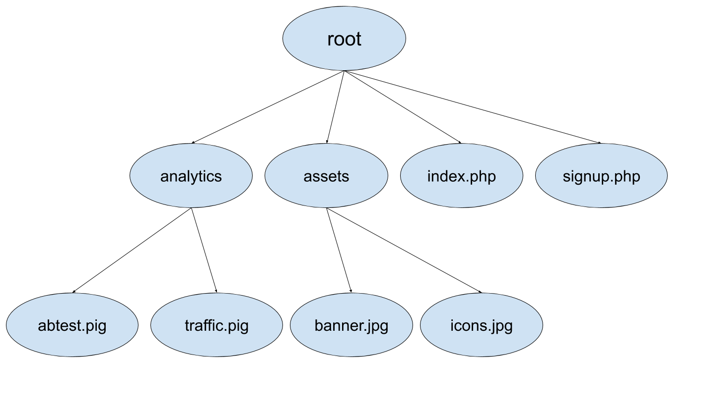
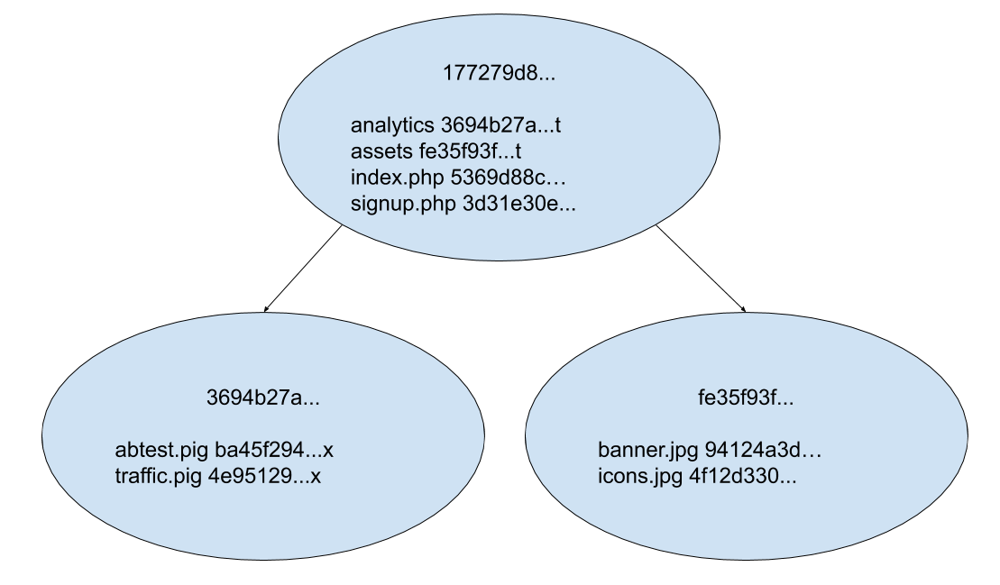
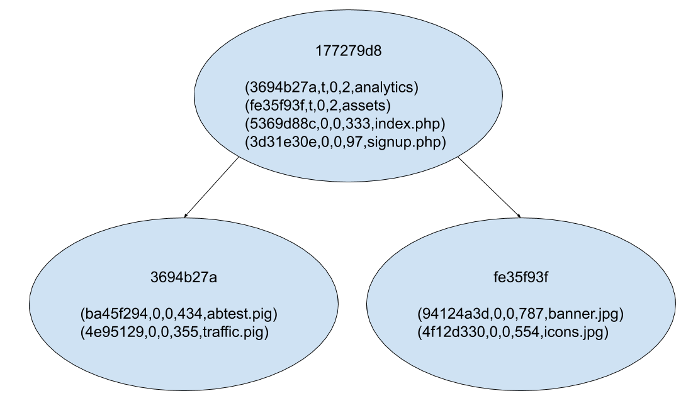

# 2019-10 Manifests, Past and Future

This document provides context and perspective about how the Manifests
implementation evolved and continues to change in our codebase. In this doc, I
cover:

* What is a manifest
* Details about flat manifest and tree manifest implementations
* Rationale for the Rust rewrite of the tree manifest code
* The Future — Deprecating old formats and converging on the Rust-based
  treemanifest implementation

## What is the Manifest?

The Manifest is the list of files in the repository at a given commit.

The major concept that we deal with is a **Repository**. A repository has two
components: **History** and **Working Copy**.  At the core of History is a
directed acyclic graph where each node is called a **Commit**. The whole graph
is called the **Commit Graph**. A Commit contains the following data: **Author,
Date, Message, Changes, and Parents**.  The Working Copy is represented by
files and directories that people interact with to make modifications. It also
keeps track of other useful information such as the **Working Copy Parent**
which is the commit that will become the first parent when the commit is
created. It anchors new commits in the Commit Graph.


There are a lot of operations that deal with the files of a repository. Given
the way I just described Commits above, we would have to do an expensive
traversal of the entire Commit Graph to compute the files in a repository. To
quickly generate the list of files in a commit, we define the **Manifest** data
structure. Manifests can be seen as indexes, precomputed data, or derived data.

We have two distinct models for Manifests: the Mercurial model and the Bonsai model.

**In Mercurial**, the Manifest is core to the data model; in fact, the Manifest
Id is the first thing added to the commit data. Mercurial creates manifest
entries before it creates the commits.

```
$ hg debugdata -c 2a18a529f6f01e3dd7505c401e20d87acbc05d7c
3fdb1f4ac9ffff62ceefccb4cacfae7fe15a2998 <- the corresponding manifest id
Testy McTest <mctest@example.com>
...
```

**With the Bonsai model,** the Manifest is derived from the commit graph. Each
Commit is a Node and every Commit Node has a corresponding Manifest Unode. The
Id of the Manifest and the Id of the Commit are independent. At commit time,
the Manifest Id is not computed (and doesn’t even have to be computed if it is
not needed). Check out the Bonsai data model for details.

## Flat Manifest

The flat manifest is the simplest means of representing Manifests;  you can
think of it as a big string that is associated with a commit identifier. The
string is a list of all the files versions that the working copy should have
for that commit.

```
$ hg debugdata -m ffb23329f6f01e3dd7505c401e20d87acbc00a33
analytics/abtest.pig 06763db6de79098e8cdf14726ca506fdf16749be**x**
analytics/traffic.pig ecf027f3b56bf7fadf8e3dd75cfcd67d8b58deb1**x**
assets/banner.jpg 5ac863e17c7035f1d11828d848fb2ca450d89794
assets/icons.jpg edd628e83c50e15004dce0207aaab63f8ceb8c97
index.php 78f7c038716f258f451528e1e8241d895419f2ee
signup.php 2943e43127ba9d2e2bdd4627a36787d0b56b5e6b
```

It is useful to acknowledge the encoding format for the manifest. The ABNF
specification is:

```
Manifest   = *( Row LF )
Row        = FilePath %x00 HgId [ Flag ]
Flag       = %s"x" / %s"l"
FilePath   = 1*( %x01-%x09 / %x0B-%xFF )
HgId       = 40HEXDIG
```

Rows are expected to be sorted in the Manifest. The flags represent either an
executable file for `x` or a symlink for `l` . Nowadays we expect file paths to
be valid UTF-8.

**Manifest Id**. It is computed using past hashes and forms a graph in its own
right. The formula for computing it is:

```
manifest_id = Sha1(min(p1, p2) + max(p1, p2) + content)
```

Where p1 and p2 are all 0s if they do not exist.

### Revlogs

In Mercurial, Manifests are stored in Revlogs. Revlogs are somewhat specific in
their implementation (check out the upstream Mercurial page for more info:
https://www.mercurial-scm.org/wiki/Revlog).  For a given `id,` the revlog will
store data in the `.d` file. The stored data may be added as a whole or as a
delta from another entry in the store. In the index file, `.i`, the revlog will
store the following metadata:

* the `id` or key that was added
* `base` will signal whether the stored data is a diff
* `linkrev`  stores the commit that is adding a manifest
    * This is an interesting design because we’ve said that the manifests are
      created before commits are added. This notion complicates things a lot so
      we’re not going to focus on it in this document.
* `parents`
    * It is probably useful to have this information for manifests but it isn’t
      fundamental. Parents are very important for the Commit Graph. Since
      Revlogs are the one true storage format that we insert the Commits,
      Manifests and File Contents into, all data will have parent information.

### Observations

* `.d` is just an append only file.
* `.i` has fixed length entries which allows it to be memory mapped and
  “randomly” accessed/parsed.
* You will see RevlogNG for index format, but that is incompatible with some of
  our extensions (e.g. remotefilelog, treemanifest)
* Flat Manifest benefit greatly from being stored as deltas from their parent.
  If the chain gets long it is expected to store the full contents. It is
  helpful for large repositories but the variance can get high.
* The content of the Manifest is stored in **text form**.

## Tree Manifest

Even if Revlog can have indexes on the index file, the Manifest itself is not
efficient. Parsing the contents of a flat Manifest is going to be expensive.
For large code bases, we can assume that commits will touch a relatively small
number of files so we would like a data structure that scales with O(|changed
files|) rather than O(|repo files|).

We can model the Manifest as trees. The simplest way to do that is to use the
natural filesystem representation where directories in the Manifest represent
internal nodes in our tree.



Modeling the Manifest as a Tree will reduce scaling of the operations to
O(|changed files| * |directory size| * |directory depth|). Assuming that
`directory size` and `directory depth` are capped, the operations are going to
be O(|changed files|). [Annex has a BTree Manifest section for another
implementation approach]

To model the tree, we want to store each node independently. Every node will
need an identifier to be used as a key.  What should the value of a node be? It
depends whether the node is a directory or a file. A file would just need a
File Revision Id and some flags but where would we store the name of the file?
Would it be part of the edge or part of node? We can reduce the number of nodes
that we have to store if we view it as being part of the edge and thus stored
as part of a directory.  A directory then needs to store the names of the files
and directories that it contains and their associations with revision ids. For
files we continue to use the file revision id that we used in Flat Manifests.
For directories we will need to construct a new identifier.

What happened was that the implementation of the Flat Manifest was used to
bootstrap the Tree Manifest implementation. A Flat Manifest that has one level
can be seen as a Tree Manifest node. From there we can tweak the implementation
to get the tree behavior. The main modification that we need to make is how we
handle directories. A new flag was added, `t`, to mark directories. So the
valid flags are now three exclusive values.

Storage was also changed from just an identifier to a pair, (path -
identifier).  Revlogs lacked good indexes at that time, so storing all entries
was seen as too expensive.  File Content Storage had a similar problem:
Mercurial stores File Content Storage in Revlogs by assigning a revlog to every
file in the repository. So the obvious storage solution for Tree Manifests was
to have a Revlog for every tree node where the name of the revlog would be the
path of the node.

Personally, I don’t like the idea having O(|files|) revlog entries. I find this
solution unfortunate. It definitely has a negative impact on the code
evolution. For files, it was originally employed also because of the Revlink
concept. The Revlink which tries to link a file with the commit it was added
in. It is, however, a flawed idea because even with separate Revlogs, the
Revlink fails to be a 1:1 mapping in cases like amend.

For our previous example we would have:

```
("", 85b666ecc1e9b6726ff90d2aaf2b3af4ceed6f2d):
analytics d1e622507595486ee06db24b1debf11064edd2ba**t**
assets 3685e330ec5277a9dd5661c61f2bc55811f5a628**t**
index.php 78f7c038716f258f451528e1e8241d895419f2ee
signup.php 2943e43127ba9d2e2bdd4627a36787d0b56b5e6b

("analytics", d1e622507595486ee06db24b1debf11064edd2ba):
abtest.pig 06763db6de79098e8cdf14726ca506fdf16749be**x**
traffic.pig ecf027f3b56bf7fadf8e3dd75cfcd67d8b58deb1**x**

("assets", 3685e330ec5277a9dd5661c61f2bc55811f5a628):
banner.jpg 5ac863e17c7035f1d11828d848fb2ca450d89794
icons.jpg edd628e83c50e15004dce0207aaab63f8ceb8c97
```

If we were to draw it as a tree we would get the following picture:


**Sort Order.** One useful observation to make before we look more into
implementations is that a Depth First traversal of the graph will not produce
the same order as the Flat Manifest implementation. As an example, let’s
consider the files: `foo/one.txt` and `foo-bar/two.txt`. The Flat Manifest
order is going to be `foo-bar/two.txt`, `foo/one.txt` , because `-` < `/` in
the ASCII table, 45 < 47. However, a Depth First traversal produces
`foo/one.txt`, `foo-bar/two.txt`, because `foo` < `foo-bar`, `null` < `-`.  For
situations where iteration order is relevant, Tree Manifests have to do
additional sorting.

### C++

Mercurial’s original Tree Manifest implementation was written in 2016 (?) in
C++ and used the pre-C++11 style to comply with the upstream Mercurial
standard.

* The code is tightly coupled and may or may not have memory leaks.
* Implemented in a zero-copy approach with the data that is read from storage.
  When modifications are made, the data is parsed into a linked list of
  entries.
* Exposes two sort orders: one natural for Tree Manifests and another that
  matches the Flat Manifest.


Overall this implementation is difficult to iterate on. Since Rust became the
language of choice for native code, it was natural to rewrite this code in
Rust.

### Rust

The Rust implementation was built without the constraints of the Mercurial
community and designed to provide a solid base to iterate on and support the
performance and reliability goals needed to support ultra large repositories.


* Data is parsed to an in-memory format after being read from storage.
* The format between the modified and unmodified entries is the same.
* Exposes only one sort order: the natural sort order for Tree Manifests. We
  didn’t get any reports that the natural order is required.


The Python boundary is rougher than the C++ implementation: Lazy iterators are
unimplemented in this boundary so iterators end up being loaded in memory
before being passed from Rust to Python. This can be improved, but there
doesn’t seem to be strong need.

The Rust implementation is more strict. The main difference to highlight is
that this implementation will not allow files to be added with the same name
when a directory already exists. Similarly folders can’t be added when files
with that name exist in the Manifest. These scenarios are tolerated by the C++
implementation.

### Content Only Hashing

The history in Manifest hashes complicates things too much and we now favor
Content Only hashes for Manifests. Parents would no longer be included in the
computation so the manifest ids would be just the hash of the content.



For operations that need history (e.g. logging a directory) we will build
separate indexes.

The main blockers for rolling this out generally is that we currently have a
lot of Revlog data on the servers that would need to be migrated. However, the
servers are going away in less than a year.

## EdenFs interactions

EdenFs is our source control-aware virtual file system that knows how to
interact with the Repository to perform efficient source control operations.

EdenFs has a complicated relationship with the C++ manifest implementation and
Mercurial storage. The plan is to migrate to the Rust Manifest and use a
Rust-only storage implementation.

EdenFs prefers a Content Only Hashing strategy. It wants that hash to determine
whether a directory has changed.

For improved performance, EdenFs would like metadata that the current Manifest
implementations don’t index yet. The main one is the file size.

Completing the above mentioned projects will significantly simplify EdenFs
storage. Without them, EdenFs instantiates a bunch of `hg debugimporthelpers`
processes to retrieve node content from Mercurial’s storage. It then parses the
values using the C++ Manifest node implementation. It then computes the content
only hash and stores that information in its own storage. And it gets more
complicated than that...

## Mononoke interactions

Mononoke is the Server that implements the core source control objects in the
cloud. It also manages object storage in XDB and Manifold.

C++ Tree Manifests were made to work with remote storage for “clients”. The
storage story can be summarized as:

1. Hg Servers have always used Revlogs that have all Manifest nodes locally.
2. Hg Clients used Revlogs, then LooseFiles, later DataPacks, later IndexedLog,
   to store the data that is necessary for constructing Trees. If data is not
   found, then a `getTreePack` request would be issued to the Hg Servers. A
   short description of how `getTreePack` works is given by the following
   pseudocode:

```
fn getTreePack(desired_manifest_id, [known_manifest_ids]) -> [nodes] {
  known_nodes = union([node for node in manifest(id) for id in known_manifest_ids])
  for node in manifest(desired_manifest_id) {
    if node not in known_nodes {
      yield node
    }
  }
}
```

Mononoke also implements the `getTreePack` protocol. The problem with this
protocol is that it is expensive in terms of data and in most situations leads
to over fetching. However the great thing about this protocol is that all
necessary data is retried over a single request.

The solution to the big response size is to allow the client to be more
specific in the data that it wants. The basic interface that is required is
`(path, id) -> content` for the history version of the Tree Manifest and simply
`id -> content` for Content Only Hashing.

**ApiService** (mononoke/apiserver or edenapi or Mononoke Data Service) is the
entity that adds support for single node tree fetches for Manifests. It is
currently an Http service but with plans to support lighter weight protocols
(building Thrift is an issue at this time but maybe we just find a good
transport layer with our own wire format).

We know the rollout of this service under the **EdenApi** name. The goal here
is to add more application specific endpoints. Right now Manifest node download
is the main use case. Looking forward, we want to add commit fetching endpoints
to it.  What this architecture allows us to do is to turn off the
`pullprefetch` feature. This feature downloads multiple Manifests at `pull`
time using the `getTreePack` protocol which makes the `pull` operation very
slow. Using the ApiService operations, the application will download only as
much data as it need which results in an overall performance win because `pull`
becomes a lot faster. Some things may become slower because they have to do
data fetching, but for common operations it shouldn’t be noticeable.  How
laptop will behave is currently unclear. We will see as we go forward.

It should be noted that batching is still very desirable and makes a big
difference in performance for both server and client. The Rust Tree Manifest
was changed from using a Depth First iteration model to a **Breadth First**
model to allow for per-level batching of node fetches. The name of the project
name for this was **BFS Diff**. It is already rolled out to all instances that
run the Rust Manifest.

**ScmQuery** / **SourceControlService**. For now we view these as the
public-facing API for Source Control.  These services exposes higher level
concepts that don't seem to overlap with what the our client applications need.

## The Future

At the time of writing there are a lot of moving pieces and several projects
are currently in flight. A few dependencies need to come together to take our
solution to the next level.

### Removing Manifest Implementations

Right now we have three big implementations for manifests in Mercurial (and
there is a least another specific implementation). We should consolidate! The
plan is to consolidate but the plan is not easy. The C++ Manifest is the first
implementation that we will be able to remove. The Rust Manifest must finish
rollout to the entire fleet, including all HG Servers. EdenFs must also start
using the Rust Manifest instead of the C++ Manifest. Plans are done, work is
progressing, all is good.

Getting rid of the Flat Manifests is more difficult. Our integration tests rely
on Flat Manifest hashes. Even the tests that instantiate Tree Manifests will
construct Flat Manifests hashes. There are also tests that explicitly use Flat
Manifests.  Maybe we are able to remove the Flat Manifest implementation by
forcing all tests to use the Tree Manifest implementation. Tree Manifests know
how to construct Flat Manifest hashes.  Converting tests to use Tree Manifest
hashes is very difficult because tests use those hashes in their commands.
Moving to a Content Only hashing scheme will change all the tests scheme again.
Figuring this out is a project. We’ll see.

The general goal is to rewrite more of the core logic and testing in Rust. Then
we just remove a lot of the Mercurial code.

### Architecture

Looking forward at our system from a higher level we are currently working
towards the following architecture:


EdenCli is what we call the metamorphosis of Mercurial as a result of the work
that we did on it.  Both the EdenCli and the EdenFs processes share the same
Manifest implementation. That implementation is the Rust Content Only Tree.
The Manifest reads and writes data to a Store. The current name we are using
for it is **ContentStore**. The role of the content store is to manage local
    only data and to cache data that is available remote.

The backend entry point for fetching data is the ApiService. It takes batches
of Manifest node identifiers and returns their contents. The ApiService talks
with Mononoke which in turns talks with Blobstore, SQL and/or Memcache to
retrieve the data for the nodes.

In this view of the world, Mononoke has a good Disaster Recovery story and the
Hg Servers are gone.

Thinking about the evolution of this architecture the relationship between
ContentStore and Memcache pops up. Setting up connections from laptops to
Memcache servers can be inefficient. It makes more sense for ApiService to
manage Memcache. This can lead to a simplified ContentStore and better Memcache
utilization.

### Serialization

One of the major problems with Manifests is that we are locked into the
original text format. We use that format on the wire. We use that format in
Revlogs, DataPacks and IndexedLogs. We use that format in Memcache.  The most
expensive part of the parsing process of Manifest entries is converting from
hex to binary.  Adding new data to the Manifests is currently a big
undertaking.

We want to change the serialization and protocol for the Manifests so that we
can more easily add data and migrate storage. We want to allow the wire
protocol to be evolved independently from the local stored format. They don’t
have to be different format but the code should not be coupled with the
serialization format as much as it is now. The new serialization format should
be binary for better performance. We can also design a storage format that is
indexed to do zero copy reads of the nodes. We also want to co-locate new
metadata with the Manifest data. EdenFs would like file sizes in metadata. For
directories, it would like the number of entries and the number of
subdirectories. It would also be nice to have a clear story for adding a new
metadata field for the future.

One of the blockers that is worth mentioning is that the hash value of our
Manifest is tightly coupled with the serialization format. The content in the
hash formula is the serialized value of the entry. We will want to have our
hashes be defined on data only, independent of format.

With some of those things done, the Manifest may look more like the following
diagram:



## Reference

1. Upstream mercurial
    1. Manifest: https://www.mercurial-scm.org/wiki/Manifest
    2. Commit: https://www.mercurial-scm.org/wiki/ChangeSet
    3. Revlog: https://www.mercurial-scm.org/wiki/Revlog
2. ABNF specification: https://tools.ietf.org/html/rfc5234

## Annex

### Useful commands

**What is the manifest id at a given commit?**

```
$ hg log -r $COMMIT_ID -T "{manifest}"
# commit id -> manifest id
$ hg log -r $COMMIT_ID -T "{node} -> {manifest}"
```

**How can I get the manifest for a given commit?**

```
$ hg dbsh
> bin = m.node.bin
> mf[bin('efc373db0efb0656c6a0739502ec88cbdd649289')]
> mf[repo['.'].manifestnode()]
```

**How can I get the underlying manifest data for a given path and id?**

```
$ hg dbsh
> bin = m.node.bin
> mf.datastore.get("", bin("f61cc4df15854d614a25f9d066755b1411a6a875"))
```

**How do I test that edenapi is able to download manifest data?**

```
$ echo $COMMIT_ID | hg debuggettrees
```

### BTree Manifests

One of the major disadvantages of the BTree Manifest is that by default we
would need store full paths for files. That is a significant amount. We can do
things to compress files sizes but it would become more complicated. It is
natural to limit the sizes of directories. Overall the directory based tree
modelling looks preferable at the moment.
